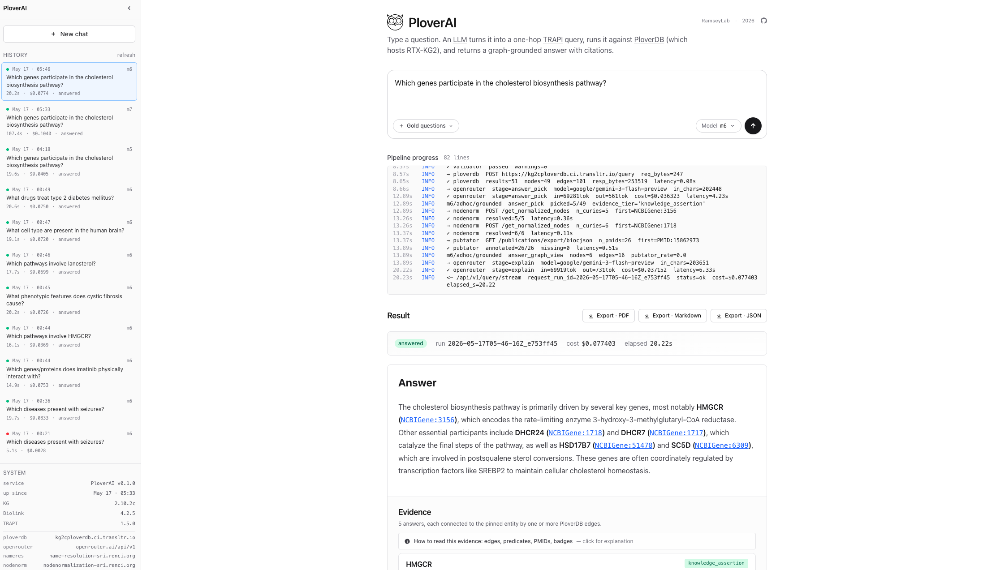

<div align="center">


# PloverAI

**A natural-language chat interface for PloverDB / RTX-KG2c, returning grounded, evidence-backed biomedical answers.**

[](https://github.com/RTXteam/PloverAI/actions/workflows/tests.yml)
[](LICENSE)
[](pipeline/requirements.txt)
[](frontend/package.json)
[](#3-research-questions)



</div>

## Abstract

PloverDB [2] hosts RTX-KG2c [1] (≈6.78M nodes, ≈27.26M edges) and serves it through the TRAPI protocol [4]. The only way to query it today is to write raw TRAPI JSON by hand, which requires fluency in CURIE conventions, the Biolink schema [3], and the TRAPI message format. PloverAI adds a chat interface: a user asks a biomedical question in plain English, an LLM constructs a one-hop TRAPI query, the query is validated against `reasoner-validator` and executed against PloverDB, and a second LLM step produces a natural-language answer cited to the supporting graph edges. The result is a hallucination-resistant biomedical QA system whose every answer can be traced back to a specific subgraph of RTX-KG2c.

## 1. Problem

### 1.1 LLMs hallucinate in biomedicine

LLMs hallucinate. In biomedicine that is dangerous. Asked *"what drugs treat type 2 diabetes,"* an LLM may confidently list drugs that don't exist, mix up names, or invent mechanisms. There is no built-in way to check what it says against a trusted source.

### 1.2 The gap: a curated knowledge graph with no user interface

Knowledge graphs fix the hallucination problem by providing a structured, curated source of truth. RTX-KG2 [1] is one of the largest biomedical KGs, built from 70+ sources including UMLS, DrugBank, ChEMBL, Reactome, and SemMedDB. RTX-KG2c is served through PloverDB [2] using the TRAPI protocol [4] and Biolink vocabulary [3].

But PloverDB has no user-facing interface. To query it, a user must hand-write TRAPI JSON, which requires knowing CURIE conventions, Biolink categories and predicates, and the TRAPI message schema. Most biomedical researchers, clinicians, and students cannot do this. ARAX [5] provides a visual query builder, but it uses ARAXi — a custom domain-specific language — rather than natural language. To the author's knowledge, no conversational interface exists for any TRAPI Knowledge Provider.

## 2. Approach

PloverAI is a two-service architecture. A FastAPI backend exposes a single endpoint, `POST /api/v1/query`, that runs the full pipeline. A Next.js frontend (built as a static export) is one client; any external Translator tool — ARAX, BioThings Explorer, a notebook — is another.

```
[browser]  ─►  Next.js static UI  (frontend/, served by nginx)
                    │
                    │  POST /api/v1/query
                    ▼
                FastAPI service   (pipeline/code/api.py, uvicorn)
                    │
                    ▼
                pipeline.run_grounded()
                    │
                    ├─► PloverDB           (TRAPI query → graph subset)
                    ├─► Name Resolution    (text → candidate CURIEs)
                    ├─► Node Normalization (CURIE → canonical CURIE)
                    └─► OpenRouter         (LLM calls per stage)

[ARAX]     ─────────────────────────────► same /api/v1/query endpoint
```

The pipeline is a multi-stage process: the LLM first extracts entities and intent from the question, NameRes resolves entity text to candidate CURIEs, NodeNorm canonicalises those CURIEs, the LLM constructs a TRAPI one-hop query graph against the Biolink schema, `reasoner-validator` enforces TRAPI 1.5 + Biolink compliance, PloverDB executes the query, and a final LLM step writes the natural-language answer with citations back to the returned edges. See [pipeline/code/README.md](pipeline/code/README.md) for the per-stage breakdown.

## 3. Research questions

Three concrete questions, each scoped to what the pipeline can demonstrate:

- **RQ1 — TRAPI construction.** Given a natural-language question, the canonical pinned CURIE produced by Name Resolution and Node Normalization, and the Biolink schema, can an LLM construct a TRAPI query graph that passes `reasoner-validator`?
- **RQ2 — Grounded answering.** When that query is sent to PloverDB and returns a real response, can the LLM pick the correct answer entity (or set) out of the returned edges, grounded in RTX-KG2c?
- **RQ3 — Explanation.** Can the LLM explain its chosen answer using only the edges and nodes returned by PloverDB — i.e., produce a citation-style justification that points back to specific TRAPI edges?

A benchmark of curated gold-answer questions and a multi-model comparison across frontier and budget LLMs (via OpenRouter) is included under [pipeline/benchmark/](pipeline/benchmark/).

## Repository layout

```
pipeline/          # python backend
  code/            #   pipeline stages, FastAPI service, tests
  benchmark/       #   gold-question set + irrelevant-question set
  config.yaml      #   model list, prices, endpoints
  requirements.txt #   pinned production deps
frontend/          # next.js (App Router, TypeScript, Tailwind v4)
  src/             #   chat UI, graph view, structured-answer renderer
deploy/            # aws ec2 deploy artifacts
  bootstrap.sh     #   one-shot fresh-instance setup
  *.template       #   nginx vhost, systemd unit, env-file examples
.github/workflows/ # ci: ruff + mypy --strict + pytest + next build
docs/img/          # screenshots, diagrams
```

## Quick start

### Backend (Python service)

```bash
cd pipeline
python -m venv .venv && source .venv/bin/activate
pip install -r requirements.txt
cp .env.example .env       # then fill in OPENROUTER_API_KEY
```

Run the always-on service locally:

```bash
PLOVERAI_API_KEY=dev-key-change-me \
  uvicorn pipeline.code.api:app --reload --port 8000
```

Or run the gold benchmark via the CLI runner — see [pipeline/README.md](pipeline/README.md).

### Frontend (Next.js UI)

```bash
cd frontend
cp .env.local.example .env.local     # adjust if the API runs elsewhere
npm install
npm run dev                          # http://localhost:3000
```

`NEXT_PUBLIC_API_KEY` in `.env.local` must equal `PLOVERAI_API_KEY` on the Python side.

## Production deployment

Config templates live under [deploy/](deploy/): nginx vhost, the `ploverai-api` systemd unit, bootstrap and update scripts, and env-file examples.

The backend runs as a `ploverai-api` systemd unit bound to `127.0.0.1:8000`. The frontend is a static export rsync'd into `/var/www/ploverai/out/`. nginx terminates TLS, enforces single shared-credential basic auth, rate-limits `/api/*`, and reverse-proxies to the FastAPI service. Same origin in production, so no CORS.

## Citing PloverAI

A paper describing PloverAI is in preparation. In the meantime, please cite the repository:

```bibtex
@misc{ploverai2026,
  author       = {Bazarkulov, Adilbek},
  title        = {{PloverAI}: a natural-language chat interface for {PloverDB} / {RTX-KG2c}},
  year         = {2026},
  howpublished = {\url{https://github.com/RTXteam/PloverAI}},
  note         = {Research preview}
}
```

BibTeX entries for all upstream services and standards used in this work are collected in [CITATIONS.bib](CITATIONS.bib).

## References

1. **RTX-KG2** — Wood EC, Glen AK, Kvarfordt LG, et al. *RTX-KG2: a system for building a semantically standardized knowledge graph for translational biomedicine.* BMC Bioinformatics 23, 400 (2022). DOI: [10.1186/s12859-022-04932-3](https://doi.org/10.1186/s12859-022-04932-3)
2. **PloverDB** — RTXteam. *PloverDB: an in-memory TRAPI knowledge-graph service.* GitHub, [RTXteam/PloverDB](https://github.com/RTXteam/PloverDB). The KG2.10.2c instance is hosted at <https://kg2cploverdb.ci.transltr.io>.
3. **Biolink Model** — Unni DR, Moxon SAT, Bada M, et al. *Biolink Model: A universal schema for knowledge graphs in clinical, biomedical, and translational science.* Clinical and Translational Science 15(8), 1848–1855 (2022). DOI: [10.1111/cts.13302](https://doi.org/10.1111/cts.13302)
4. **TRAPI** — NCATS Biomedical Data Translator Consortium. *Translator Reasoner API (TRAPI) specification.* GitHub, [NCATSTranslator/ReasonerAPI](https://github.com/NCATSTranslator/ReasonerAPI).
5. **ARAX** — Glen AK, Ma C, Mendoza L, et al. *ARAX: a graph-based modular reasoning tool for translational biomedicine.* Bioinformatics 39(3), btad082 (2023). DOI: [10.1093/bioinformatics/btad082](https://doi.org/10.1093/bioinformatics/btad082)
6. **Translator Program** — The Biomedical Data Translator Consortium. *The Biomedical Data Translator Program: Conception, Culture, and Community.* Clinical and Translational Science 12(2), 91–94 (2019). DOI: [10.1111/cts.12592](https://doi.org/10.1111/cts.12592)
7. **NodeNormalization** — TranslatorSRI. *Service to canonicalise CURIE identifiers across biomedical vocabularies.* GitHub, [TranslatorSRI/NodeNormalization](https://github.com/TranslatorSRI/NodeNormalization).
8. **NameResolution** — TranslatorSRI. *Service to resolve free-text biomedical concept names to candidate CURIEs.* GitHub, [TranslatorSRI/NameResolution](https://github.com/TranslatorSRI/NameResolution).

## Acknowledgments

PloverAI builds on infrastructure developed by the NCATS Biomedical Data Translator program [6]. RTX-KG2 [1] and PloverDB [2] are developed and maintained by the Expander Agent team. LLM access is routed through [OpenRouter](https://openrouter.ai) so the same pipeline can be evaluated across frontier and budget models from multiple providers under one API.

## License

MIT — see [LICENSE](LICENSE).
