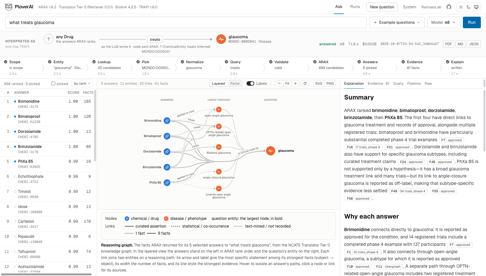

<div align="center">


# PloverAI

**Ask a biomedical question in plain English. ARAX answers it over the NCATS Biomedical Data Translator's Tier 0 knowledge graph, and every claim in the explanation cites a fact.**

[](https://github.com/RTXteam/PloverAI/actions/workflows/tests.yml)
[](LICENSE)
[](pipeline/requirements.txt)
[](frontend/package.json)
[](#how-it-works)



</div>

## Abstract

ARAX, the reasoner of the NCATS Biomedical Data Translator, answers questions written as TRAPI queries: JSON graphs of Biolink categories, predicates and CURIEs. Few biomedical researchers can write them by hand. PloverAI lets them ask in plain English. An LLM pipeline turns the question into a one-hop TRAPI query, grounding every entity in Translator's own services. The query is checked with `reasoner-validator` and sent to ARAX, which reasons over the Translator's Tier 0 graph. ARAX's ranked answers and reasoning paths come back, and an LLM explains them. Every claim in the explanation cites a numbered fact on ARAX's paths, so it can be checked against its source.

## How it works

A question runs through 15 stages. Six of them call an LLM. The others are deterministic code and calls to Translator services. The web UI shows them as eleven steps:

| Step | What happens |
|---|---|
| Scope | an LLM decides whether the question is a biomedical question the graph can answer |
| Entity | an LLM extracts the entity the question is about and the kind of answer it asks for |
| Lookup | Name Resolution lists candidate CURIEs for the entity |
| Pick | an LLM picks the candidate, shown for the first few how many Tier 0 facts they have (probed through Retriever) |
| Normalize | Node Normalization gives the canonical CURIE and its categories |
| Query | an LLM writes the TRAPI query, choosing among the predicates Tier 0 actually holds for that pair of categories |
| Validate | `reasoner-validator` checks the query before anything is sent |
| ARAX | ARAX reasons over Tier 0 and returns ranked answers with their reasoning paths |
| Answers | an LLM picks the answers to explain from ARAX's top results |
| Evidence | the facts on the picked answers' paths are numbered F1..Fn, with what each rests on (sources, approvals, trials, publications) |
| Explain | an LLM writes the explanation, citing each claim as [F#] |

The pipeline is a standalone HTTP service. The web UI is one client of it; anything that speaks HTTP can call `POST /api/v1/query` too.

```
[browser]  ─►  Next.js static UI  (frontend/, served by nginx)
                    │
                    │  POST /api/v1/query/stream
                    ▼
                FastAPI service   (pipeline/code/api.py, uvicorn)
                    │
                    ▼
                pipeline.run_grounded()
                    │
                    ├─► ARAX               (TRAPI query → ranked answers + reasoning paths)
                    ├─► Retriever          (Tier 0 meta knowledge graph + entity probes)
                    ├─► Name Resolution    (text → candidate CURIEs)
                    ├─► Node Normalization (CURIE → canonical CURIE)
                    └─► OpenRouter         (the six LLM stages)
```

| Service | Endpoint | Role |
|---|---|---|
| ARAX 1.6.2 (TRAPI 1.6, Biolink 4.2.5) | `https://arax.ncats.io/api/arax/v1.4` | reasoning over Tier 0 |
| Retriever, Tier 0 (`parameters.tiers=[0]`) | `https://retriever.ci.transltr.io` | the meta knowledge graph at start-up and the entity probes |
| Name Resolution, Node Normalization | `name-resolution-sri.renci.org`, `nodenormalization-sri.renci.org` | entity resolution and canonical CURIEs |
| OpenRouter | `https://openrouter.ai/api/v1` | the six LLM stages |

The Translator services are free and public. The only paid part is the LLM. With `openai/gpt-6-luna` one question cost $0.0013 to $0.0027 (nine runs, 2026-09-29). Endpoints and models live in `pipeline/config.yaml`.

## The web UI

A full-width workbench:

- **Top band.** The question as the LLM read it, with the TRAPI query it wrote and the one sent to ARAX. Under it, the eleven steps with their timing and cost.
- **Answers.** ARAX's ranked answers with score and number of facts, marked where the LLM picked them.
- **Reasoning graph.** A deterministic, left-to-right figure: answers, the entities linking them, and the question's entity. Links that make the same statement about the same entity merge into one line. Line width is the number of facts, and line style is the strongest evidence. Hovering an answer, entity or link lights its paths, its rows in the answers table and its facts in the evidence list. Export as SVG or PNG.
- **Inspector.** The explanation with citation cards, the evidence behind every fact, the query, all 15 stages with their prompts and artifacts, the raw artifacts and the live log.
- **Runs.** Every run on the server, filterable by question, model and outcome. Any run opens at `/?run=<run_id>`.

## Setup

### Backend

Python 3.12.

```bash
cd pipeline
python3.12 -m venv .venv && source .venv/bin/activate
pip install -r requirements.txt
cp .env.example .env       # then set OPENROUTER_API_KEY
```

Run the service from the repository root (the code imports as `pipeline.code.*`):

```bash
cd ..
PLOVERAI_API_KEY=dev-key-change-me \
  pipeline/.venv/bin/uvicorn pipeline.code.api:app --port 8000
```

It is ready when the log says `meta_KG cached`. It reads Retriever's meta knowledge graph at start-up, which takes a few seconds.

### Frontend

```bash
cd frontend
cp .env.local.example .env.local     # adjust if the API runs elsewhere
npm install
npm run dev                          # http://localhost:3000
```

`NEXT_PUBLIC_API_KEY` in `.env.local` must equal `PLOVERAI_API_KEY` on the Python side.

## Benchmark

`pipeline/benchmark/` holds two question sets:

- 19 curated questions with gold answers: q1–q10 are the development split and q11–q19 the held-out test split;
- 81 question files converted from the expert-labelled NCATS Translator Tests.

The runner (`pipeline/code/runner.py`) runs them through the pipeline. The scorer (`pipeline/code/scorer.py`) scores the runs offline. See [pipeline/README.md](pipeline/README.md) and [pipeline/benchmark/README.md](pipeline/benchmark/README.md).

## Layout

- `pipeline/`: the Python backend: pipeline, FastAPI service, benchmark runner and scorer, question sets, tests.
- `frontend/`: Next.js 16 (App Router, React 19, TypeScript, Tailwind v4), built as a static export, so production needs no Node runtime.
- `deploy/`: nginx, systemd and bootstrap templates, and the step-by-step guide for one AWS EC2 instance. The public site runs without a login. It serves one inexpensive model, limits questions per address and per day, and rate-limits at nginx.

## History

Until 2026-09-28 PloverAI was a chat interface for PloverDB, querying RTX-KG2.10.2c one hop at a time with no reasoner. That system is in this repository's history up to commit `b37b3d4`.

## Citation

The works PloverAI builds on are in [CITATIONS.bib](CITATIONS.bib).

## License

[MIT](LICENSE).
