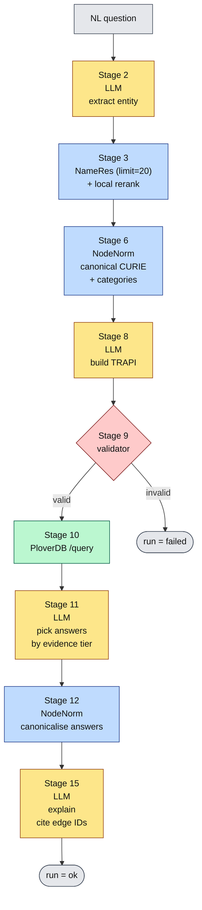

# How the pipeline works (plain English)

You ask:

> *What drugs treat type 2 diabetes mellitus?*

The pipeline's job is to answer that using only what's actually in the
RTX-KG2c knowledge graph (via PloverDB), and to **show** which graph
edges its answer came from. There are 15 stages numbered 1..15. Each
one has a single, narrow job. Concrete data flows through them —
this doc traces the diabetes question all the way through.

Stages come in three kinds:

- **LLM** (6 stages: 1, 2, 4, 8, 11, 15) — calls to OpenRouter. The
  ones that turn natural language into structured pipeline state.
- **service** (5 stages: 3, 6, 10, 12, 14) — HTTP calls to external
  Translator services (NameRes, NodeNorm, PloverDB, PubTator).
- **function** (4 stages: 5, 7, 9, 13) — pure local computations
  inside `pipeline.py`. No network call. Reranking, similarity check,
  TRAPI validation, graph-view assembly.

The whole thing has one rule the LLM must obey: **it never sees the
gold answer key.** The gold record (which says "the right pinned CURIE
is `MONDO:0005148`, the right answer includes `CHEBI:6801` for
metformin") gets written to disk for the **scorer** to use later. The
LLM's only input from the gold record is the natural-language question
text. Everything else it has to figure out.

---

## At a glance

Every label below is kept short on purpose — GitHub's Mermaid
renderer caps node width and crops longer text. The full per-stage
detail is in the sections after the diagram.



**Example used throughout this doc.** *"What drugs treat type 2
diabetes mellitus?"*

**What each stage is** (table below covers all 15; the Mermaid diagram
above only draws the main retrieval path — Stages 1, 4, 5, 7, 13, 14
are helpers covered in their own sections lower in this doc):

| #  | what it is                       | kind     | who runs it              |
|----|----------------------------------|----------|--------------------------|
| 1  | scope check (in/out gate)        | LLM      | OpenRouter               |
| 2  | entity extraction                | LLM      | OpenRouter               |
| 3  | name lookup (wide + reranked)    | service  | RENCI Name Resolution    |
| 4  | candidate pick                   | LLM      | OpenRouter               |
| 5  | IC re-rank                       | function | local                    |
| 6  | CURIE canonicalisation (pinned)  | service  | RENCI Node Normalization |
| 7  | consistency check                | function | local                    |
| 8  | TRAPI query construction         | LLM      | OpenRouter               |
| 9  | TRAPI / Biolink check            | function | reasoner-validator       |
| 10 | knowledge-graph query            | service  | PloverDB                 |
| 11 | answer selection                 | LLM      | OpenRouter               |
| 12 | answer canonicalisation          | service  | RENCI Node Normalization |
| 13 | build graph view                 | function | local                    |
| 14 | PubTator enrichment              | service  | PubTator                 |
| 15 | natural-language reply           | LLM      | OpenRouter               |

Two stages grew an in-stage refinement after v15: **Stage 12b** collapses
cross-vocabulary duplicate answers (the same protein returned under both
an `NCBIGene` and a `CHEMBL.TARGET` id), and **Stage 13b** decomposes a
grouped target into its component genes. Both are documented in their
parent stage's section.

The colour fill on each box just reinforces the rightmost column —
yellow boxes are LLM calls, blue are RENCI, green is PloverDB, red
is the validator, grey is input/terminal.

**Failure paths (not drawn to keep the diagram readable).** Any LLM
call can fail to `llm_error`. Stage 2 can produce an empty mention
(`entity_empty`). Stage 3 can return zero candidates
(`nameres_failed`). Stage 6 can fail to canonicalise
(`nodenorm_failed`). Stage 10 can fail (`plover_error`). Stages 8 and
11 can produce non-JSON (`llm_bad_json`). All terminal statuses are
recorded in `meta.json` for the per-stage failure-mode analysis.

For a terminal-friendly view (no Mermaid renderer needed):

```
                        NL question
                             │
            ┌────────────────┴────────────────┐
            ▼                                 │
   [2]   LLM extracts entity mention          │  yellow = LLM
            │                                 │  blue   = RENCI
            ▼                                 │  green  = PloverDB
   [3]   NameRes (limit=20) + rerank          │  red    = validator
            │                                 │
            ▼                                 │
   [6]   NodeNorm           (canonical id +   │
            │                Biolink types)   │
            ▼                                 │
   [8]   LLM builds TRAPI query graph         │
            │                                 │
            ▼                                 │
   [9]   reasoner-validator ────invalid──→  STOP (status: invalid_query)
            │ valid                           │
            ▼                                 │
   [10]  PloverDB /query                      │
            │                                 │
            ▼                                 │
   [11]  LLM picks answer CURIEs              │
            │ (ranks by knowledge_level/      │
            │  agent_type — see §Evidence)    │
            ▼                                 │
   [12]  NodeNorm canonicalises answers       │
            │                                 │
            ▼                                 │
   [15]  LLM writes paragraph with edge cites │
            │                                 │
            ▼                                 │
                          run = ok ──────────┘
```

---

## Stage 2 — *what entity is this question about?*

**Why it's needed.** PloverDB indexes by canonical IDs like
`MONDO:0005148`, not by free text. Before we can ask the graph
anything, we have to pull the focal entity out of the question and
turn it into an ID. The LLM does the *extraction* part here; the
ID lookup happens in Stages 3 → 6 (NameRes top-K, then NodeNorm
canonicalises the chosen candidate). Stage 2 also emits a Biolink
`expected_category` and a `granularity_preference` ("general" vs
"specific") so the downstream lookup can filter NameRes by type and
re-rank by information_content where the question wants the broad
concept.

**What it does.** We send the LLM a tiny, single-purpose prompt:

> *"You extract the focal biomedical entity from a user's question. Output ONLY the entity name."*

Plus the question. The LLM replies with one short string:

```
type 2 diabetes mellitus
```

No JSON, no explanation, just the name. That string is the only thing
that flows to the next stage.

**Why a separate stage.** The LLM is good at picking the right span of
text for the focal entity (which is a language task), and bad at
remembering exact CURIE digits (which is a memorisation task). This
stage uses the LLM only for the part it's reliable at. The rest is
delegated to RENCI services.

Code: [`prompts.py`](prompts.py) (`SYS_ENTITY_EXTRACT`),
[`pipeline.py`](pipeline.py) Stage 2.

---

## Stage 3 — *find the canonical ID for that entity*

**Why it's needed.** Even with a clean entity name, we can't just
guess a CURIE. There's no rule that maps "type 2 diabetes mellitus"
to `MONDO:0005148` other than asking an authoritative service. If the
LLM hallucinates a plausible-looking ID, validation might still pass
but PloverDB will quietly return zero hits.

**What it does.** We send the entity mention to **RENCI's Name
Resolution** service (`/lookup`) with `limit=20` and a Biolink-type
filter. The filter is derived from Stage 2's `expected_category` via
**BMT (Biolink Model Toolkit)**: we send the picked category plus the
descendants of its parent (when the parent isn't a generic umbrella
like `BiologicalEntity`). So `expected_category=biolink:Pathway`
becomes `biolink_type=Pathway,BiologicalProcess,Behavior,
PhysiologicalProcess,PathologicalProcess` — the same concept is often
typed under a sibling Biolink class across ontologies, and one strict
filter excludes correct answers. See [`biolink_helper.py`](biolink_helper.py).

NameRes returns ranked candidates:

```
1. MONDO:0005148  type 2 diabetes mellitus
2. MONDO:0005149  type 2 diabetes mellitus, susceptibility to
3. MONDO:0024292  early-onset, autosomal dominant type 2 diabetes
4. ...
```

**BM25 rank is treated as a recall hint, NOT a precision vote.** The
raw NameRes order is biased toward longer labels that contain the
query string ("Hypoglycemic seizures" outscores the canonical
"Seizure" for the query "seizures"). We re-rank locally with a
5-tier lexicographic key — see [§Stage 3 rerank](#stage-3-rerank)
below for the details — so exact label / synonym / token / type
matches beat raw BM25 before Stage 4 picks. The original BM25 rank
stays on each record for traceability.

**Strict-first, loose-fallback.** The pipeline actually fires Stage 3
twice in worst case:

1. STRICT pass: `biolink_type=[expected_category]` only, then probe
   the top-10 of the reranked result for KG2c edges to the answer
   category (one `/query` per CURIE to PloverDB).
2. LOOSE pass: only if EVERY strict candidate has zero KG2c edges,
   retry with the BMT-derived neighborhood filter. The cholesterol-
   biosynthesis case: STRICT `[Pathway]` returns PANTHER + REACT
   entries all with 0 edges → fall back to LOOSE → `GO:0006695`
   (typed as `BiologicalProcess`) surfaces with 101 edges.

**Why this service and not the LLM.** Name Resolution is built and
maintained by the Translator project specifically for this lookup.
It's also what the chat frontend uses in production. Using it here
means the benchmark and the live product agree on entity resolution
instead of the benchmark testing one path and the product behaving
on a different one.

Code: [`nameres_client.py`](nameres_client.py),
[`biolink_helper.py`](biolink_helper.py),
[`plover_client.py`](plover_client.py) (`probe_predicates`),
[`pipeline.py`](pipeline.py) (`_rerank_nameres_candidates`,
`_probe_candidates`, `_has_any_kg_coverage`).

<a id="stage-3-rerank"></a>
### Stage 3 rerank — tier scheme

Each candidate's sort key is the tuple `(T1, T2, T3, T4, T5)` sorted
descending. Higher tiers always beat lower ones; raw BM25 only
breaks ties within a tier.

| Tier | Signal | Why |
|---|---|---|
| T1 | exact label match against the mention (case-folded) | "Seizure" beats "Hypoglycemic seizures" when the user types "seizure" |
| T2 | exact synonym match against the mention | catches the case where the mention is in the synonym list but not the label |
| T3 | mention is a whole token in label or synonym | catches "seizures" inside "Febrile seizures" / etc. |
| T4 | `expected_category` is in the candidate's `types` list | reverses BM25's type-blindness when the loose filter is active |
| T5 | raw BM25 score | safety net so candidates without a discriminating signal still have a deterministic order |

---

## Stage 6 — *clean up that ID*

**Why it's needed.** The same concept can have many IDs across
ontologies — a drug might be `DRUGBANK:DB00331` in one place and
`CHEBI:6801` in another, but those are the same molecule. NameRes
might return whichever one its index prefers, and that may not be
the one KG2c stores under. NodeNorm folds all those IDs to one
canonical form, plus tells us the Biolink type, plus gives us the
list of equivalent IDs for free.

**What it does.** We send `MONDO:0005148`, NodeNorm replies:

```json
{
  "canonical_curie": "MONDO:0005148",
  "label":           "type 2 diabetes mellitus",
  "categories":      ["biolink:Disease", "biolink:DiseaseOrPhenotypicFeature", ...]
}
```

**Why this matters specifically here.** PloverDB and KG2c are built
using this same canonicalisation service. Whatever NodeNorm says is
canonical is what PloverDB knows about. Skipping this would let us
send a non-canonical CURIE that PloverDB doesn't index well — the
query passes validation, hits PloverDB, and gets zero results, with
no obvious reason why.

**Bonus use of NodeNorm.** It also tells us the Biolink categories
of the pinned entity. The LLM in Stage 8 needs that to construct a
valid TRAPI query — without it, the LLM would have to guess the
type, which is exactly the kind of guessing we're trying to remove.

Code: [`nodenorm_client.py`](nodenorm_client.py).

---

## Stage 8 — *turn the question into a TRAPI query*

**Why it's needed.** PloverDB only speaks TRAPI. To ask it anything
we have to translate the user's English question into a TRAPI 1.5
JSON query graph. This is the heart of the NL → KG translation.

**Predicate-density probe (Stage 8 setup).** Before the LLM picks a
predicate, the pipeline reuses the per-candidate probe from Stage 4
for the CHOSEN CURIE (or fires a fresh probe if NodeNorm canonicalised
to a different form). One TRAPI call to PloverDB without a predicate
filter returns every edge connecting the pinned CURIE to the answer
category, in either direction. We tally per-predicate counts and
inject them into the Stage 8 user prompt sorted by count desc.

This grounds the LLM in the ACTUAL edge distribution rather than the
schema-valid-predicate list. Concrete example: for the brain → Cell
question, `biolink:located_in` is schema-valid but populated 1× from
brain; `biolink:has_part` is populated 103×. Without the probe the
LLM picks the semantically obvious `located_in` and PloverDB returns
0 results. With the probe in the prompt, the LLM sees the count
distribution and picks `has_part`. See
[`plover_client.py`](plover_client.py) (`probe_predicates`) and the
on-disk artifact `predicate_probe.json`.

**What it does.** Now we have everything the LLM needs to build the
actual graph query: the user's English question, the resolved pinned
entity, AND the live predicate-density distribution for that CURIE.
We give it those, plus the rules of TRAPI 1.5 (one-hop, two nodes,
one edge, real Biolink terms only), and it produces JSON:

```json
{
  "message": {
    "query_graph": {
      "nodes": {
        "n0": {"ids": ["MONDO:0005148"], "categories": ["biolink:Disease"]},
        "n1": {"categories": ["biolink:Drug"]}
      },
      "edges": {
        "e0": {"subject": "n1", "object": "n0", "predicates": ["biolink:treats"]}
      }
    }
  }
}
```

The LLM had to figure out three things on its own:
- which side of the edge is the disease vs the drug (`subject`/`object` direction)
- the answer node's Biolink category (`biolink:Drug`)
- the predicate (`biolink:treats`)

It got the canonical CURIE and the Biolink categories handed to it
from the previous stage — but **not** from gold.

Code: [`prompts.py`](prompts.py) (`SYS_TRAPI_BUILD`),
[`pipeline.py`](pipeline.py) Stage 8.

---

## Stage 9 — *check the query is well-formed*

**Why it's needed.** LLMs hallucinate predicate names, invent
Biolink categories, and miswire `subject`/`object`. Sending a
malformed query to PloverDB wastes a network call and pollutes the
results folder with garbage. The validator catches all of that
deterministically before any production resource gets hit.

**What it does.** Its query goes through NCATS Translator's
`reasoner-validator`, which checks:

- the JSON shape matches the TRAPI 1.5 schema
- every Biolink term used (`biolink:Drug`, `biolink:treats`, etc.) actually exists
- the predicate is allowed for that subject/object pair

If it fails, the run **stops here**. We record what the LLM produced
and what the validator complained about, and move on to the next
question. There's no retry loop in v15 — the feasibility result we
want is "how often does the LLM produce a valid query *on the first
try*?"

Code: [`trapi_validator.py`](trapi_validator.py).

---

## Stage 10 — *actually ask PloverDB*

**Why it's needed.** This is the only place in the pipeline where the
real knowledge graph data enters. Every claim downstream (Stages 11
and 15) traces back to edges that came out of *this* call. If this
stage didn't happen, the whole project is just an LLM with vibes.

**What it does.** The valid query is POSTed to
`kg2cploverdb.ci.transltr.io/query`. Out comes a TRAPI response: a
list of nodes, edges, and "results" (matching subgraphs). For the
diabetes example, ~126 results come back — every drug PloverDB
knows that treats `MONDO:0005148`, plus the supporting edges, plus
the metadata for each edge (which source it came from, what evidence
level it has).

PloverDB itself is fast — typically under 1 second for a narrow
query like this.

Code: [`plover_client.py`](plover_client.py).

---

## Stage 11 — *pick the answer entities from the response*

**Why it's needed.** The TRAPI response is exhaustive: it contains
every entity satisfying the query, regardless of how good the
evidence is. A broad query can return tens or hundreds of edges,
some of which are strong human-curated assertions and some of which
are weak text-mining co-occurrences. The user wants a short list of
*best-supported* answers, not an unranked dump. This stage is the
ranking + filtering step.

**What it does.** The LLM gets the response (already sorted
strongest-first by the reduction step) and one question: out of these
results, which entities are the actual answers? In the default
iterative mode it reads the response in strongest-first chunks and
ranks its picks by *relevance*, using evidence strength only to break
ties; the single-shot fallback ranks strictly by strength. It returns
a small JSON list:

```json
{
  "answers": [
    {"curie": "CHEBI:6801",  "label": "metformin",   "supporting_edge_ids": ["e0_001"]},
    {"curie": "CHEBI:9300",  "label": "sitagliptin", "supporting_edge_ids": ["e0_017"]}
  ],
  "rationale": "Selected entities supported by knowledge_assertion edges from DrugBank."
}
```

The strength ordering — used to rank in single-shot mode and to break
ties in iterative mode — is the **evidence-strength ladder** in
[§Evidence](#evidence) below.

Code: [`prompts.py`](prompts.py) (`SYS_ANSWER_PICK_ITER` for the default
iterative mode, `SYS_ANSWER_PICK` for single-shot),
[`pipeline.py`](pipeline.py) Stage 11.

---

## Stage 12 — *canonicalize the answer IDs*

**Why it's needed.** The LLM may emit IDs in any flavor that
appeared in the response (DrugBank, MeSH, UMLS, ...). The gold
record may use a different flavor (often ChEBI or NCBI). A literal
string compare would mark right answers wrong. This stage makes the
comparison ID-agnostic.

**What it does.** Run all of the LLM's picks through **NodeNorm**
again. If the LLM said `DRUGBANK:DB00331`, NodeNorm collapses it to
`CHEBI:6801`. Now `answer.json` has both versions:

```json
{
  "answers":          [...the original LLM picks...],
  "canonical_curies": ["CHEBI:6801", "CHEBI:9300", ...]
}
```

The offline scorer compares `canonical_curies` against
`gold.anchors[0].curie`. Without this stage the scorer would call
right answers wrong because of identifier differences.

**Stage 12b — collapse cross-vocabulary duplicates.** The same protein
can come back under several namespaces: KIT as `NCBIGene:3815` *and* as
the ChEMBL target `CHEMBL.TARGET:CHEMBL1936` ("Stem cell growth factor
receptor"). NodeNorm carries ChEMBL *compound* ids but not ChEMBL
*target* ids, so those duplicates survive Stage 12. Stage 12b resolves
each picked answer to its canonical gene identity — NodeNorm for
genes/proteins, plus a one-hop in-graph `target → biolink:Gene` lookup
for ChEMBL targets NodeNorm can't see — and merges answers that resolve
to the same gene, keeping the gene-symbol representative ("KIT", not the
trimmed ChEMBL label) and recording what was merged in `merged_from`. A
multi-gene target (a kinase *family* record like ABL → ABL1 + ABL2) gets
a set-valued identity, so genuinely distinct targets are never collapsed.
Code: [`pipeline.py`](pipeline.py) `_dedup_answers`.

---

## Stage 15 — *write a human-readable explanation*

**Why it's needed.** A list of CURIEs and edge ids is unreadable to a
researcher who isn't already fluent in Biolink. We need a short
paragraph in plain English. But "plain English" is exactly where
LLMs hallucinate, so this stage carries the project's strictest
constraint.

**What it does.** Finally we ask the LLM for a short paragraph (3–6
sentences) the user can read. The hard rule: **every factual claim
must cite at least one specific edge** from the TRAPI response by
its edge id. So instead of:

> "Metformin treats type 2 diabetes." *(believe me, bro)*

we get:

> "Based on edge `e0_001` connecting metformin (`CHEBI:6801`) to type
> 2 diabetes (`MONDO:0005148`) via `biolink:treats`, metformin is a
> treatment for type 2 diabetes per RTX-KG2 provenance from DrugBank."

Now the user can check the citation. That's the whole point of
grounding.

On top of the cite-every-claim rule, Stage 15 enforces four
faithfulness guards so the prose never drifts past the graph:

- **Claim & predicate fidelity.** State only the relationship the edge's
  predicate asserts. `biolink:physically_interacts_with` means "physically
  interacts with", not "inhibits" or "treats", and no importance/primacy
  editorialising ("the primary therapeutic target") unless an edge says so.
  The Stage 11 ranking notes (`why` / `rationale`) are stripped before this
  stage so their background knowledge can't leak into the answer.
- **Entity-type fidelity.** Render each entity as the kind its Biolink
  category licenses. Never upgrade a grouping / protein / gene node into a
  physical "complex"; name a grouped target as the grouped target it is.
- **Presence fidelity.** Only entities that appear as their own node are
  "present". A name inside another node's label (COX-1 inside "COX-1/COX-2")
  is not, unless surfaced via the Stage 13b decomposition.
- **Provenance tiers.** Phrasing is gated by a STRONG / MODERATE / WEAK tier
  derived from `knowledge_level` plus whether a named source or PMID exists,
  so an un-sourced curated edge gets hedged language, not "established".

Code: [`prompts.py`](prompts.py) (`SYS_EXPLAIN`),
[`pipeline.py`](pipeline.py) Stage 15.

---

## Helper stages (not in the main diagram)

The Mermaid + ASCII diagrams above show the main retrieval path. The
six stages below run alongside but don't change the question →
TRAPI → answer flow; they make the pipeline more honest, less wasteful,
or more diagnosable.

### Stage 1 — *scope check* (LLM)

Runs BEFORE Stage 2. The LLM is asked "is this a biomedical question
PloverAI should run through retrieval, or is it out of scope?". Returns
`{"in_scope": bool, "reason": str}`. When false, the pipeline exits
cleanly with `status=out_of_scope` and a fixed-template explanation
(see [`prompts.py`](prompts.py) `SYS_SCOPE_CHECK`). Catches policy
opinions, personal medical advice, off-domain questions, etc. Gold
negative examples live at
[`../benchmark/golden_questions/irrelevant/`](../benchmark/golden_questions/irrelevant/).

### Stage 4 — *candidate pick* (LLM)

Sits between NameRes (Stage 3) and IC re-rank (Stage 5). The LLM
sees the top-10 of the locally-reranked NameRes candidates plus the
per-candidate `kg2c_edges_to_<answer_category>` count from the
density probe, and picks one CURIE — or returns `chosen_curie=null`
with a reason if none of the candidates is a plausible match. Null →
status `no_candidate_match`. Defends against three failure modes BM25
alone can't catch: typo survivors, label-type collisions, and
"perfect-label-but-zero-KG2c-coverage" picks (e.g. preferring
`GO:0006695` over `PANTHER.PATHWAY:P00014` for cholesterol
biosynthesis). See [`prompts.py`](prompts.py) `SYS_CANDIDATE_PICK`.

### Stage 5 — *information-content re-rank* (function)

When Stage 2's `granularity_preference == "general"` we re-sort the
top-K NameRes candidates by NodeNorm's `information_content` ascending
(lower IC = broader concept) so the most general available match wins.
For `granularity == "specific"` we keep Stage 4's pick untouched. Pure
function, no separate artifact.

### Stage 7 — *consistency check* (function)

Compares the user's free-text mention against the canonical label
NameRes + NodeNorm resolved to, via the max of difflib's
`SequenceMatcher.ratio` and substring containment. If the score is
below `LOW_CONFIDENCE_THRESHOLD = 0.50`, the run aborts with status
`low_confidence_resolution` rather than firing a TRAPI query against
a probably-wrong entity. Catches typos like "diabites" silently
landing on "sialidosis type 2" (score ≈ 0.38) while still passing
near-matches like "warfrin" → "warfarin" (score ≈ 0.93). Pure function.

### Stage 13 — *build graph view* (function)

After Stage 12 canonicalises the answer CURIEs, this stage reshapes
the (pinned entity + picked answers + relevant edges from the
PloverDB knowledge graph) into the node-link `answer_graph_view`
the frontend renders. Pure function over the pipeline's existing
state; emits `answer_graph_view.json`. Three details make the view
faithful:

- **Authoritative node typing.** Each answer node carries its canonical
  Biolink `category` (from the node's `biolink:category` attribute, not
  just `categories[0]`) plus an `is_grouping` flag, so a grouped target
  (a ChEMBL selectivity group typed `biolink:GeneFamily`) renders as the
  grouping it is, never invented into a physical "complex".
- **Matched-concept endpoints.** KG2c expands the pinned node to
  descendant / equivalent concepts, so a picked edge's real subject is
  often a *descendant* of the pinned node, not the pinned node itself
  (querying "Focal-onset seizure" returns edges from "Focal hemiclonic
  seizure"). The view emits these `edge_endpoint_nodes` with labels so the
  UI can draw the honest **query → matched concept → answer** chain instead
  of pretending the pinned node is the edge's subject.
- **Stage 13b — grouped-target decomposition.** When a picked answer is a
  grouped target, a follow-up one-hop `group → biolink:Gene` query resolves
  its component genes (the COX-1/COX-2 group → PTGS1 + PTGS2). They are
  surfaced as the group's *components*, never as direct interactors, so the
  answer stays strictly one-hop.

### Stage 14 — *PubTator enrichment* (service)

For each edge in the answer graph that cites PMIDs, the pipeline
asks NCBI's PubTator whether the supporting PMIDs independently
co-mention both endpoints (NER-level check using PubTator's own
biomedical entity index, not the KG's). The result is an
edge-by-edge "verified / unverified / not-applicable" badge that
the UI surfaces alongside the cited evidence. Adds an external
verification signal that's INDEPENDENT of the KG provenance chain —
strong tie-break when two answers share the same `knowledge_level`.
See [`pubtator_client.py`](pubtator_client.py).

---

<a id="evidence"></a>
## Evidence — how we judge "stronger" answers

Two things rank evidence, and it's worth being precise about which does
what. **Deterministic code** (the reduction step inside Stage 11,
[`reduction.py`](reduction.py)) sorts every edge by strength, strongest
first. **The LLM** then selects the answer entities: the default
iterative selector ranks them by *relevance* and uses the code-computed
strength only to break ties, while the single-shot selector (the
fallback) picks strictly by strength. This section is the rule book for
the strength ordering both rely on.

### Two metadata fields KG2c gives us per edge

Every edge in PloverDB's response carries (where the source supplied
them) two Biolink fields that describe its provenance:

- **`knowledge_level`** — *what kind of statement is this edge?*
  Is it a curated assertion someone wrote down, or a number from a
  statistical model, or a guess from a prediction algorithm?
- **`agent_type`** — *who or what produced it?* A human curator? A
  text-mining pipeline? An automated workflow?

Together they give us a defensible answer to "should I trust this
edge more than that one?"

### The evidence-strength ladder (Biolink `KnowledgeLevelEnum`)

We rank from strongest (top) to weakest (bottom):

| # | `knowledge_level`        | What it means                                                          | When you'd see it                                       |
|---|--------------------------|------------------------------------------------------------------------|---------------------------------------------------------|
| 1 | `knowledge_assertion`    | Someone explicitly asserted this fact.                                 | DrugBank approvals, OMIM gene-disease, ClinVar.         |
| 2 | `logical_entailment`     | Derived by formal inference (e.g. ontology subclass reasoning).        | "Drug X treats Disease Y because Y *is_a* Z and X treats Z." |
| 3 | `prediction`             | Output of a predictive model.                                          | DepMap, in-silico target predictions.                   |
| 4 | `statistical_association`| Co-occurrence/correlation, no causal claim.                            | Some SemMedDB or text-mining edges.                     |
| 5 | `observation`            | Observed in some experiment but no formal assertion.                   | Some text-mined experimental observations.              |
| 6 | `not_provided`           | The source didn't say.                                                 | Anywhere a source omitted the field.                    |

This ordering is a **heuristic** — Biolink defines the values but
doesn't formally rank them. The hierarchy reflects measurements on
real KG2c data: curated drug-treats-disease edges consistently came
back with `knowledge_assertion`, while text-mined edges came back
with `prediction` or `statistical_association`. This ladder is the
`knowledge_level` key inside the deterministic edge sort in
[`reduction.py`](reduction.py), so the selector always reads the
response strongest-first.

### `agent_type` as a tiebreaker

When two candidates share the same `knowledge_level`, prefer:

`manual_agent` > `automated_agent` > `data_analysis_pipeline` > `computational_model` > `text_mining_agent` > `not_provided`

(Same direction: human-curated beats model-produced.) An edge with
`knowledge_assertion` + `manual_agent` is the strongest combination
the graph can show; `prediction` + `text_mining_agent` is much weaker
even though the predicate may look the same.

### Tier-fallback policy (single-shot selector)

PloverDB will not always return a `knowledge_assertion` edge. Some
questions only have weaker evidence in KG2c. The **single-shot**
selector ranks strictly by strength and follows these rules (the
iterative selector instead ranks by relevance, so it may mix tiers when
a weaker-tier edge is the more relevant answer):

1. **Pick the strongest tier present in the response.** If
   `knowledge_assertion` exists, every answer comes from there. If
   not, drop one tier and try again.
2. **Never silently mix tiers.** If your answers came from two
   different tiers, that's a flag worth noting in the explanation.
3. **Always report the tier you used.** The Stage-15 explanation says
   *"per RTX-KG2 provenance from DrugBank"* (curated) or *"based on
   text-mining co-occurrence"* (statistical). The user should know
   how strong the evidence is, not just *that* there is some.
4. **If the only tier is `not_provided`**, return an answer with a
   warning: "evidence level not recorded for the supporting edges,"
   and let the user decide.
5. **Empty answer is allowed.** If the response truly contains
   nothing relevant, the LLM is told to return `{"answers": []}`
   with a one-line rationale rather than fabricate something.

This gives a graceful degradation: strong evidence wins; in its
absence, the user gets the next-best with the strength surfaced.

### How this gets enforced

Two layers, one deterministic and one model-driven:

- **Edge strength: deterministic code.** [`reduction.py`](reduction.py)
  builds an `edge_sort_key` per edge — source tier (curated above
  text-mined, the leading key), then `knowledge_level`, then `agent_type`,
  then publication count — and sorts every predicate group by it.
  Text-mined edges are demoted below all curated ones, so the LLM never
  computes strength: it receives the edges already ordered.
- **Answer selection: the LLM.** The default **iterative** selector
  (`SYS_ANSWER_PICK_ITER`) reads the sorted response in strongest-first
  chunks and ranks its picks by *relevance*, using the pre-computed
  strength only as a tie-breaker. The **single-shot** fallback
  (`SYS_ANSWER_PICK`) instead picks by the strength ladder directly.

The split is deliberate: the deterministic sort keeps the strength
ordering reproducible and out of the benchmark's variance, while the LLM
is still tested on the harder judgment — which of the sorted candidates
are actually relevant answers to the question.

### What ends up on disk

For every run, `nodenorm.json` carries the canonical IDs the LLM
selected, and `plover_response.json` carries the full edge metadata
(`knowledge_level`, `agent_type`, `sources`). So a human reader (or the
offline scorer) can replay the ranking: which strength tier each picked
edge sat in, and whether a stronger or more relevant edge went unpicked.
Nothing is hidden.


---

## What ends up on disk

Each invocation of the runner creates **one parent folder** —
`RUN_<utc-timestamp>/` — and every model that ran in that invocation
sits as a sibling inside it. Inside each model folder, every
question gets its own folder.

```
outputs/
└── <guest_uuid>/                            ← per-visitor namespace (X-Guest-Id from the UI;
    │                                          isolates sidebar history between browsers)
    └── RUN_2026-05-27T18-15-07Z_9c239c57/   ← one folder per pipeline invocation
        ├── run.json                         ← top-level summary: which models + questions ran together
        ├── m5_anthropic_claude-haiku-4.5/
        │   ├── run.json                     ← per-model summary
        │   └── grounded/
        │       └── adhoc/                   ← one folder per question (q1, q2, … or "adhoc"
        │           │                          for live API-driven runs)
        │           ├── question.json            ← gold record (or NL question), frozen, NEVER seen by the LLM
        │           ├── prompt.json              ← exactly what we sent the LLM at each stage (all 6 LLM stages)
        │           ├── nameres.json             ← Stage 3: top-20 candidates + biolink filter applied + rerank vs BM25 top-1
        │           ├── candidate_probes.json    ← Stage 4 setup: per-candidate kg2c_edges_to_<answer_cat> + fallback flag
        │           ├── nodenorm.json            ← Stage 6 (pinned) + Stage 12 (answers) NodeNorm output
        │           ├── predicate_probe.json     ← Stage 8 setup: predicate-density probe for the CHOSEN CURIE
        │           ├── trapi_query.json         ← Stage 8: the LLM-built TRAPI query
        │           ├── validation.json          ← Stage 9: whether reasoner-validator accepted it
        │           ├── plover_request.json      ← Stage 10: exact bytes POSTed to PloverDB
        │           ├── plover_response.json     ← Stage 10: what PloverDB returned (full)
        │           ├── reduced_data.json        ← Stage 10b: PloverDB response after Strategy B
        │           │                              reduction (top-N per predicate); this is what
        │           │                              Stage 11 actually saw, and what the faithfulness
        │           │                              metric evaluates the LLM's claims against
        │           ├── reduction_metadata.json  ← Stage 10b: per-predicate kept/dropped counts +
        │           │                              the strategy + N applied
        │           ├── answer.json              ← Stage 11: the LLM's picks (raw + canonicalized by Stage 12)
        │           ├── answer_graph_view.json   ← Stage 13: node-link graph view rendered by the
        │           │                              frontend (each edge carries id, source, target,
        │           │                              predicate, knowledge_level, agent_type,
        │           │                              primary_knowledge_source, supporting_publications,
        │           │                              supporting_text_snippets, and a pubtator_verified
        │           │                              block when PubTator ran)
        │           ├── explanation.md           ← Stage 15: the structured Markdown paragraph
        │           ├── cost.json                ← tokens + USD + latency for each LLM call
        │           └── meta.json                ← status + outcome + outcome_reason + counts
        ├── m7_openai_gpt-5/                     ← if this model ran in the same invocation
        │   └── grounded/adhoc/...
        └── ...
```

**Why this shape.** Three layers carry meaning:
1. **`<guest_uuid>/`** — namespace per browser (mints a UUID v4 into
   localStorage on first visit, sent as `X-Guest-Id` on every API
   request). Two visitors can't see each other's sidebar history,
   but anyone with a direct run URL can still open it (capability
   lookup; see `pipeline/code/api.py:_find_run_dir_any_guest`).
2. **`RUN_<utc_ts>_<nonce>/`** — one invocation. Multiple models
   that ran together are siblings inside the same RUN folder, so
   `ls` answers "which models were compared in this run."
3. **`<model_id>_<slug>/grounded/<q_id>/`** — the leaf where the
   per-question artifacts live. `grounded` is the condition (the
   only one the live API exposes; the offline benchmark also writes
   an `ungrounded` peer for baseline runs). `q_id` is the gold
   question id (`q1`, `q2`, …) for benchmark runs, or `adhoc` for
   live API queries.

Re-running the same model twice creates two `RUN_*` folders, never
overwrites.

**Logs use the same layout.** The per-run log lives at
`logs/RUN_<run_timestamp>/run.log` — same folder name as the
matching `outputs/RUN_<run_timestamp>/`. Cross-reference is just
"open the folder with the same name in the other dir."

Anyone can open any folder six months from now and reconstruct
exactly what happened — what the user asked, what the LLM produced
at each step, whether RENCI's services agreed, what PloverDB said,
what the answer was, what it cost. **No hidden state.**

---

## Ad-hoc questions

You don't have to use the gold set. The runner accepts a free-form
NL question with `--question`:

```bash
python -m code.runner --question "What treats Crohn's disease?"
python -m code.runner --model m7 --question "What genes are linked to ALS?"
```

What changes:

- The pipeline runs the same 15 stages — scope check → entity
  extraction → NameRes (wide + reranked, strict-then-loose) →
  candidate pick → IC re-rank → NodeNorm pinned → consistency check →
  TRAPI build (with predicate-density probe) → validate → PloverDB →
  answer pick → NodeNorm answers → graph-view build → PubTator
  enrichment → explanation. Nothing is skipped.
- The synthetic question record (`{"id": "adhoc", "nl_question": ...,
  "adhoc": true}`) gets written to `question.json` in the artifact
  folder, so future analysis scripts can spot ad-hoc runs and skip
  them when computing gold-based metrics.
- Output folder: `outputs/RUN_<ts>/<model>/adhoc/...` (same layout,
  the question id is just `adhoc`).
- Default model is `m5` (Haiku — cheap, fast) so a one-shot ad-hoc
  query is one short command. Override with `--model <id>`.

`--question` is mutually exclusive with `--questions`; `--model` is
mutually exclusive with `--models`. Both fail loudly at the CLI
boundary if combined.

## Run outcomes vs runtime status

Each per-question `meta.json` carries **two** orthogonal status
fields, because "the pipeline finished cleanly" and "the model
actually answered the question" are different things.

| field            | what it means                                  | values |
|------------------|------------------------------------------------|--------|
| `status`         | did the pipeline finish without runtime errors?| `ok`, `invalid_query`, `plover_error`, `llm_error`, `nameres_failed`, `nodenorm_failed`, `llm_bad_json`, `entity_empty` |
| `outcome`        | did the model actually answer the question?    | `answered`, `no_results`, `no_answer_picked`, `null` |
| `outcome_reason` | one short sentence explaining the outcome      | string or null |
| `plover_n_results` | how many TRAPI results PloverDB returned    | int (`-1` if Stage 10 didn't run) |
| `answers_n_picked` | how many CURIEs the LLM selected at Stage 11 | int (`-1` if Stage 11 didn't run) |

### How to read the combination

- **`status=ok` + `outcome=answered`** — clean end-to-end success.
- **`status=ok` + `outcome=no_results`** — the pipeline ran fine,
  but PloverDB returned **zero** results for the constructed query.
  Almost always means the upstream resolution went wrong: NameRes
  picked a non-canonical CURIE for the entity, or the predicate
  doesn't fit what KG2c stores. Inspect `nameres.json` and
  `nodenorm.json` first — that's where the wrong turn happened.
- **`status=ok` + `outcome=no_answer_picked`** — PloverDB returned
  results but the LLM declined to select any of them. Read
  `outcome_reason` (it carries the LLM's own rationale) to see why.
- **`status=invalid_query`** (or any other non-`ok` status) —
  the pipeline stopped mid-stage. `outcome` is `null` because no
  semantic result was produced. The status tells you which stage
  failed; `error` carries the specific message.

### Concrete example

q2 asks *"What diseases are associated with CFTR?"*. If a model's
NameRes/NodeNorm chain picks `NCBIGene:403154` instead of the gold
`NCBIGene:1080` (CFTR proper), PloverDB returns zero results for
that ID, and the LLM correctly says "I couldn't find any."

That run's `meta.json` will look like:

```json
{
  "q_id": "q2",
  "status": "ok",
  "outcome": "no_results",
  "outcome_reason": "PloverDB returned 0 results for the constructed query (pinned CURIE: NCBIGene:403154). Possible cause: NameRes top-1 picked a non-canonical or wrong identifier...",
  "plover_n_results": 0,
  "answers_n_picked": 0,
  "error": null,
  "elapsed_s": 18.2
}
```

The summary table in the terminal flags it the same way: status `ok`
in green, outcome `no_results` in yellow.

## Where the gold record fits in

Gold is the **answer key for the scorer, never an input to the LLM.**
The pipeline genuinely answers the NL question end-to-end. The scorer
(offline, separate program) reads each output folder and asks:

- did NameRes/NodeNorm produce the same canonical CURIE the gold says is right? (`nameres_top1_match`)
- did the LLM produce a TRAPI query that passed validation? (`valid_trapi_rate`)
- did PloverDB actually return a response? (`plover_executed_rate`)
- did the LLM's canonicalized answers contain the gold anchor? (`answer_match`)
- did the explanation cite at least one real edge? (`explanation_cites_real_edge`)

That gives a per-stage diagnosis — "the failures happened mostly at
validation" vs. "the LLM kept picking wrong answers" vs. "NodeNorm
couldn't resolve the entity for q3" — instead of one flat pass/fail.

---

## File-to-stage map

| Stage | File | Role |
|---|---|---|
| 1   | [`prompts.py`](prompts.py) `SYS_SCOPE_CHECK` + [`openrouter_client.py`](openrouter_client.py) | LLM in/out gate; pipeline exits with `out_of_scope` on a `false` |
| 2   | [`prompts.py`](prompts.py) `SYS_ENTITY_EXTRACT` | LLM extracts focal entity + expected/answer category + granularity |
| 3   | [`nameres_client.py`](nameres_client.py) + [`biolink_helper.py`](biolink_helper.py) + [`pipeline.py`](pipeline.py) (`_rerank_nameres_candidates`, `_probe_candidates`, `_has_any_kg_coverage`) | NameRes lookup (limit=20) + BMT-aware filter + local 5-tier rerank + per-candidate density probe + strict-first / loose-fallback |
| 4   | [`prompts.py`](prompts.py) `SYS_CANDIDATE_PICK` | LLM picks among the top-10 reranked candidates (or returns null) |
| 5   | [`pipeline.py`](pipeline.py) (IC re-rank block) | Re-rank candidates by NodeNorm `information_content` ascending when granularity=general |
| 6   | [`nodenorm_client.py`](nodenorm_client.py) | Canonicalize the chosen pinned CURIE; expose Biolink categories |
| 7   | [`pipeline.py`](pipeline.py) (`_check_label_consistency`) | difflib similarity between mention and resolved label; abort below 0.50 |
| 8   | [`prompts.py`](prompts.py) `SYS_TRAPI_BUILD` + [`plover_client.py`](plover_client.py) (`probe_predicates`) | LLM builds the TRAPI query, grounded by the predicate-density probe injected into its prompt |
| 9   | [`trapi_validator.py`](trapi_validator.py) | reasoner-validator gate (v15: invalid → stop) |
| 10  | [`plover_client.py`](plover_client.py) | POST to PloverDB `/query` |
| 11  | [`prompts.py`](prompts.py) `SYS_ANSWER_PICK` | LLM picks answer CURIEs from the response |
| 12  | [`nodenorm_client.py`](nodenorm_client.py) | Canonicalize answer CURIEs for scoring |
| 13  | [`pipeline.py`](pipeline.py) (`_build_answer_graph_view`) | Reshape pinned + picks + KG edges into the frontend's node-link view |
| 14  | [`pubtator_client.py`](pubtator_client.py) | Per-edge co-mention check via PubTator NER |
| 15  | [`prompts.py`](prompts.py) `SYS_EXPLAIN` | LLM writes structured Markdown with edge citations |
| —   | [`pipeline.py`](pipeline.py) | The orchestrator that wires Stages 1 → 15 in order |
| —   | [`runner.py`](runner.py) | CLI entry: argparse, banner, progress bar, summary table |
| —   | [`api.py`](api.py) | FastAPI service: `/api/v1/query`, `/query/stream`, `/runs`, `/runs/{id}` |
| —   | [`config.py`](config.py) + [`../config.yaml`](../config.yaml) | Models, prices, endpoints, paths |
| —   | [`logging_setup.py`](logging_setup.py) | Shared rich console + per-run log file |
| —   | [`trace.py`](trace.py) | Owns the on-disk artifact layout (never overwrites) |
| —   | [`cost.py`](cost.py) | USD-cost calculation per (in_tokens, out_tokens) |
