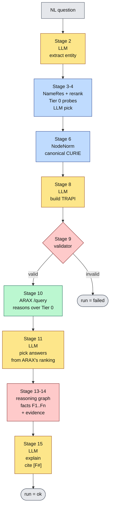

# How the pipeline works (plain English)

You ask:

> *What drugs treat type 2 diabetes mellitus?*

The pipeline's job is to get that answer from **ARAX**, the reasoner of
the NCATS Biomedical Data Translator, and to **show** why ARAX gave it:
the reasoning paths from each answer to the question's entity, every
fact on them numbered F1..Fn, and what each fact rests on (approvals,
trials, drug labels, papers). ARAX reasons over the Translator's
**Tier 0** knowledge graph. The pipeline reads the same graph from
**Retriever** for its meta knowledge graph and its entity probes.

There are 15 stages, numbered 1..15. Each one has a single, narrow job.
This doc traces the diabetes question through them.

Stages come in three kinds:

- **LLM** (6 stages: 1, 2, 4, 8, 11, 15): calls to OpenRouter. They
  turn natural language into structured pipeline state and back.
- **service** (4 stages: 3, 6, 10, 12): HTTP calls to Translator
  services (NameRes, NodeNorm, ARAX). Stage 4 also probes Retriever
  before its LLM call.
- **function** (5 stages: 5, 7, 9, 13, 14): local computations. No
  network call. Re-ranking, similarity check, TRAPI validation, the
  reasoning graph, and the evidence behind each fact.

The whole thing has one rule the LLM must obey: **it never sees the
gold answer key.** The gold record (which says "the right pinned CURIE
is `MONDO:0005148`, the right answer includes `CHEBI:6801` for
metformin") gets written to disk for the **scorer** to use later. The
LLM's only input from the gold record is the natural-language question
text. Everything else it has to figure out.

**The benchmark's second reasoner.** `runner --reasoner lookup` sends
the same Stage 8 query to Retriever as a one-hop Tier 0 lookup, and the
LLM does the reasoning over a ranked table of facts. That condition is
the comparison for ARAX. Where a stage works differently under
`lookup`, its section says so. The UI always uses ARAX.

**History.** Until 2026-09-28 Stage 10 queried PloverDB (RTX-KG2.10.2c)
one hop at a time. That version, and the benchmark runs made with it
(`grounded/`, `oracle_*/` condition folders), are frozen on the `main`
branch at tag `benchmark-freeze-2026-09-28`. Examples below that were
measured on KG2 say so.

---

## At a glance

Every label below is kept short on purpose. GitHub's Mermaid renderer
caps node width and crops longer text. The per-stage detail is in the
sections after the diagram.


```mermaid
flowchart TD
    Q["NL question"]
    S2["Stage 2<br>LLM<br>extract entity"]
    S3["Stage 3-4<br>NameRes + rerank<br>Tier 0 probes<br>LLM pick"]
    S6["Stage 6<br>NodeNorm<br>canonical CURIE"]
    S8["Stage 8<br>LLM<br>build TRAPI"]
    S9{"Stage 9<br>validator"}
    S10["Stage 10<br>ARAX /query<br>reasons over Tier 0"]
    S11["Stage 11<br>LLM<br>pick answers<br>from ARAX's ranking"]
    S13["Stage 13-14<br>reasoning graph<br>facts F1..Fn<br>+ evidence"]
    S15["Stage 15<br>LLM<br>explain<br>cite [F#]"]
    OK([run = ok])
    FAIL([run = failed])

    Q --> S2 --> S3 --> S6 --> S8 --> S9
    S9 -->|valid| S10 --> S11 --> S13 --> S15 --> OK
    S9 -->|invalid| FAIL

    classDef llm      fill:#fde68a,stroke:#92400e,color:#111
    classDef renci    fill:#bfdbfe,stroke:#1e3a8a,color:#111
    classDef reasoner fill:#bbf7d0,stroke:#065f46,color:#111
    classDef local    fill:#fecaca,stroke:#7f1d1d,color:#111
    classDef io       fill:#e5e7eb,stroke:#374151,color:#111

    class S2,S8,S11,S15 llm
    class S3,S6 renci
    class S10 reasoner
    class S9,S13 local
    class Q,OK,FAIL io
```

**What each stage is** (the table covers all 15; the diagram draws
the main path only):

| #  | what it is                       | kind     | who runs it                                   |
|----|----------------------------------|----------|-----------------------------------------------|
| 1  | scope check (in/out gate)        | LLM      | OpenRouter                                    |
| 2  | entity extraction                | LLM      | OpenRouter                                    |
| 3  | name lookup (wide + reranked)    | service  | RENCI Name Resolution                         |
| 4  | candidate pick                   | LLM      | OpenRouter, after Tier 0 probes on Retriever  |
| 5  | IC re-rank                       | function | local                                         |
| 6  | CURIE canonicalisation (pinned)  | service  | RENCI Node Normalization                      |
| 7  | consistency check                | function | local                                         |
| 8  | TRAPI query construction         | LLM      | OpenRouter                                    |
| 9  | TRAPI / Biolink check            | function | reasoner-validator                            |
| 10 | reasoner query                   | service  | ARAX (`lookup`: Retriever)                    |
| 11 | answer selection                 | LLM      | OpenRouter                                    |
| 12 | answer canonicalisation          | service  | RENCI Node Normalization                      |
| 13 | reasoning graph                  | function | local (`lookup`: answer graph view)           |
| 14 | evidence extraction              | function | local (`lookup`: PubTator check, a service)   |
| 15 | natural-language explanation     | LLM      | OpenRouter                                    |

Box colours: yellow is an LLM call, blue is RENCI, green is ARAX, red
is local code, grey is input or a terminal state.

**Failure paths (not drawn).** Any LLM call can fail to `llm_error`,
or stop at the token cap (`llm_truncated`). Stage 1 can refuse the
question (`out_of_scope`). Stage 2 can produce an empty mention
(`entity_empty`). Stage 3 can return zero candidates
(`nameres_failed`). Stage 4 can decide no candidate fits
(`no_candidate_match`). Stage 6 can fail to canonicalise
(`nodenorm_failed`). Stage 7 can refuse a resolution that drifted from
the mention (`low_confidence_resolution`). Stage 8 can decline to build
a query (`query_declined`) or reply with non-JSON (`llm_bad_json`, also
possible at Stage 11). Stage 9 can reject the query (`invalid_query`).
Stage 10 can fail (`arax_error`, or `lookup_error` under `lookup`).
Every terminal status is recorded in `meta.json` for the per-stage
failure analysis.

For a terminal-friendly view (no Mermaid renderer needed):

```
                        NL question
                             │
   [1]   LLM scope check ──out of scope──→  STOP (status: out_of_scope)
            │
   [2]   LLM extracts entity mention
            │
   [3]   NameRes (limit=20) + local rerank
            │
   [4]   Tier 0 probes (first 3 candidates, Retriever) + LLM picks one
            │
   [5-7] IC re-rank, NodeNorm canonical id + Biolink types, consistency check
            │
   [8]   LLM builds TRAPI query graph
            │   then ask_arax_to_reason puts treatment / gene-regulation
            │   queries in the form ARAX reasons on
            │
   [9]   reasoner-validator ────invalid──→  STOP (status: invalid_query)
            │ valid
   [10]  ARAX /query (progress stream, up to 600 s)
            │
   [11]  LLM picks answers from ARAX's ranked list
            │
   [12]  NodeNorm canonicalises answers
            │
   [13]  reasoning paths answer → question entity, facts F1..Fn
            │
   [14]  evidence per fact: approvals, trials, labels, PMIDs, co-mention
            │
   [15]  LLM writes Summary / Why each answer / How strong is the evidence
            │
         run = ok
```

---

## Stage 2: *what entity is this question about?*

**Why it's needed.** ARAX and the Tier 0 graph index by canonical IDs
like `MONDO:0005148`, not by free text. Before we can ask the graph
anything, we have to pull the focal entity out of the question and
turn it into an ID. The LLM does the *extraction* part here. The ID
lookup happens in Stages 3 to 6 (NameRes candidates, then NodeNorm
canonicalises the chosen one). Stage 2 also emits a Biolink
`expected_category`, the `answer_category` the question asks for, and
a `granularity_preference` ("general" or "specific"), so the lookup
can filter NameRes by type and re-rank by information content when the
question wants the broad concept.

**What it does.** The LLM gets a single-purpose prompt and the
question, and returns JSON with those four fields. For the example the
entity is:

```
type 2 diabetes mellitus
```

**Why a separate stage.** The LLM is good at picking the right span of
text for the focal entity (a language task), and bad at remembering
exact CURIE digits (a memorisation task). This stage uses the LLM only
for the part it is reliable at. The rest goes to RENCI services.

Code: [`prompts.py`](prompts.py) (`SYS_ENTITY_EXTRACT`),
[`pipeline.py`](pipeline.py) Stage 2 (`_parse_stage0_output`).

---

## Stage 3: *find candidate IDs for that entity*

**Why it's needed.** Even with a clean entity name, we can't guess a
CURIE. Nothing maps "type 2 diabetes mellitus" to `MONDO:0005148`
except an authoritative service. If the LLM invents a plausible ID,
validation may still pass, and the reasoner quietly returns nothing.

**What it does.** We send the mention to **RENCI Name Resolution**
(`/lookup`) with `limit=20` and a Biolink type filter. The filter comes
from Stage 2's `expected_category` via **BMT (Biolink Model Toolkit)**:
the picked category plus the descendants of its parent (when the
parent is not a generic umbrella like `BiologicalEntity`). So
`expected_category=biolink:Pathway` becomes `biolink_type=Pathway,
BiologicalProcess,Behavior,PhysiologicalProcess,PathologicalProcess`.
The same concept is often typed under a sibling class in another
ontology, and one strict filter would exclude correct answers. See
[`biolink_helper.py`](biolink_helper.py).

NameRes returns ranked candidates:

```
1. MONDO:0005148  type 2 diabetes mellitus
2. MONDO:0005149  type 2 diabetes mellitus, susceptibility to
3. MONDO:0024292  early-onset, autosomal dominant type 2 diabetes
4. ...
```

**BM25 rank is a recall hint, not a precision vote.** The raw NameRes
order favours longer labels that contain the query string
("Hypoglycemic seizures" outscores the canonical "Seizure" for the
query "seizures"). We re-rank locally with a 5-tier key (see
[§Stage 3 rerank](#stage-3-rerank)), so exact label, synonym, token
and type matches beat raw BM25 before Stage 4 picks. The original BM25
rank stays on each record for traceability.

**Tier 0 probes, strict first, loose as fallback.** The first 3
reranked candidates (`retriever.probe_candidates`) are each probed on
Retriever: one Tier 0 TRAPI query from the candidate to the answer
category with no predicate, which counts the facts per predicate and
direction. The probes run in parallel, each with its own 30 s timeout
(`retriever.probe_timeout_s`), because a hub entity can return tens of
MB (pain: 3,945 results, 66 MB, 25 s on 2026-09-29). A probe that
times out counts as "unknown", never as "no facts". Stage 3 runs in
two passes at most:

1. STRICT pass: `biolink_type=[expected_category]` only, then probe.
2. LOOSE pass: only if no strict candidate has a single Tier 0 fact,
   retry with the BMT neighbourhood filter and probe again. The
   motivating case, found on KG2: for cholesterol biosynthesis the
   strict `[Pathway]` filter returned only PANTHER and Reactome
   entries with no facts, and the loose pass surfaced `GO:0006695`
   (typed as `BiologicalProcess`), which had them.

**Probes skip restated facts.** Retriever restates a fact about a
descendant of the pinned entity (a subtype of the disease) as a fact
about the pinned entity itself, backed by `biolink:support_graphs`,
and orients the restatement like the query edge instead of like the
fact. On rheumatoid arthritis (2026-09-29) all 1,599 such edges came
back reversed, which turned the direction hints around. The probe
skips edges that carry support graphs. The descendant's own fact is
in the reply too, so nothing is lost.

**Why this service and not the LLM.** Name Resolution is built and
maintained by the Translator project for exactly this lookup. The
benchmark and the live product use the same path, so they agree on
entity resolution.

Code: [`nameres_client.py`](nameres_client.py),
[`biolink_helper.py`](biolink_helper.py),
[`retriever_client.py`](retriever_client.py) (`probe_predicates`,
`tally_probe_edges`), [`pipeline.py`](pipeline.py)
(`_rerank_nameres_candidates`, `_probe_candidates`,
`_has_any_kg_coverage`).

<a id="stage-3-rerank"></a>
### Stage 3 rerank: tier scheme

Each candidate's sort key is the tuple `(T1, T2, T3, T4, T5)` sorted
descending. Higher tiers always beat lower ones. Raw BM25 only breaks
ties within a tier.

| Tier | Signal | Why |
|---|---|---|
| T1 | exact label match against the mention (case-folded) | "Seizure" beats "Hypoglycemic seizures" when the user types "seizure" |
| T2 | exact synonym match against the mention | catches the case where the mention is in the synonym list but not the label |
| T3 | mention is a whole token in label or synonym | catches "seizures" inside "Febrile seizures" |
| T4 | `expected_category` is in the candidate's `types` list | reverses BM25's type-blindness when the loose filter is active |
| T5 | raw BM25 score | safety net, so candidates with no other signal still have a deterministic order |

---

## Stage 6: *clean up that ID*

**Why it's needed.** The same concept can have many IDs across
ontologies. A drug might be `DRUGBANK:DB00331` in one place and
`CHEBI:6801` in another. NameRes may return whichever one its index
prefers. NodeNorm folds all of them to one canonical form, gives the
Biolink types, and lists the equivalent IDs.

**What it does.** We send `MONDO:0005148`, NodeNorm replies:

```json
{
  "canonical_curie": "MONDO:0005148",
  "label":           "type 2 diabetes mellitus",
  "categories":      ["biolink:Disease", "biolink:DiseaseOrPhenotypicFeature", ...]
}
```

**Why this matters here.** NodeNorm is the Translator's shared
identifier service, so its canonical CURIE is the form ARAX and
Retriever expect. A non-canonical CURIE can pass validation and still
return nothing, with no obvious reason why.

**Categories the graph knows.** NodeNorm answers in a newer Biolink
(4.4.3 on 2026-09-29) than ARAX and the validator (4.2.5), so a pinned
entity can carry categories they do not know. The pipeline keeps only
the categories that appear in Tier 0's meta knowledge graph
(`categories_known_to_kg`), in NodeNorm's order, and Stage 8 is shown
those. The LLM needs them to build a valid query, and without them it
would have to guess the type.

Code: [`nodenorm_client.py`](nodenorm_client.py),
[`pipeline.py`](pipeline.py) (`categories_known_to_kg`).

---

## Stage 8: *turn the question into a TRAPI query*

**Why it's needed.** ARAX and Retriever only speak TRAPI. The user's
English question has to become a TRAPI query graph. This is the heart
of the NL to KG translation.

**What grounds the predicate.** Two things from Tier 0 go into the
Stage 8 prompt:

- **The predicate index.** At start-up the runner and the API fetch
  Retriever's meta knowledge graph once and invert it into a
  `(subject_category, object_category) → [predicates]` index. Stage 8
  is shown the schema-valid predicates for the pinned category and the
  answer category, in both directions.
- **The predicate-density probe.** The Stage 4 probe for the chosen
  CURIE is reused (a fresh probe runs only if NodeNorm renamed the
  CURIE). It lists every predicate that actually connects this CURIE
  to the answer category, with its fact count, dominant direction and
  qualifier sets, densest first. It is saved as
  `predicate_probe.json`.

The probe grounds the LLM in the facts that exist, not only the ones
the schema allows. On KG2 this fixed questions like brain → Cell,
where `biolink:located_in` was schema-valid but had one fact and
`biolink:has_part` had 103. When the probe finds zero facts, the
prompt falls back to the schema list with a warning.

**What it does.** The LLM gets the question, the resolved pinned
entity with its categories, the answer category, the predicate block,
and, for ARAX, a note on when to ask ARAX to reason
(`prompts.ARAX_TRAPI_NOTE`). It returns a one-hop query graph (two
nodes, one edge):

```json
{
  "message": {
    "query_graph": {
      "nodes": {
        "n0": {"ids": ["MONDO:0005148"], "categories": ["biolink:Disease"]},
        "n1": {"categories": ["biolink:ChemicalEntity"]}
      },
      "edges": {
        "e0": {"subject": "n1", "object": "n0",
               "predicates": ["biolink:treats"], "knowledge_type": "inferred"}
      }
    }
  }
}
```

The LLM decides the direction of the edge, the answer node's category
and the predicate. It got the canonical CURIE and the categories from
the previous stages, never from gold. If no predicate fits the
question, the prompt allows an `{"error": ...}` reply. The run then
stops cleanly with `status=query_declined` and nothing is sent.

The query graph stays one hop. ARAX does the multi-hop reasoning
behind it.

Code: [`prompts.py`](prompts.py) (`SYS_TRAPI_BUILD`, `ARAX_TRAPI_NOTE`),
[`retriever_client.py`](retriever_client.py) (`build_predicate_index`,
`build_category_set`), [`pipeline.py`](pipeline.py) Stage 8.

### After Stage 8: *ask ARAX to reason* (ARAX only)

ARAX reasons (multi-hop, with support graphs) only when the query edge
says `knowledge_type: "inferred"`. Its treatment inference also needs
a `biolink:ChemicalEntity` answer node: on 2026-09-29 the same inferred
rheumatoid arthritis query ran for over 20 minutes without an answer
with `biolink:Drug`, and answered in 49 s with `ChemicalEntity`. The
prompt asks for this, but models skip it. So a deterministic step,
`arax_reasoning.ask_arax_to_reason`, puts the two shapes ARAX can infer
in the form it needs:

- **What treats a disease**: a treats-family predicate, an unpinned
  chemical and a pinned disease or phenotype. The predicate becomes
  `biolink:treats` and the edge is turned so the chemical is the
  subject.
- **What raises or lowers a gene**: `biolink:affects` with
  `qualifier_constraints`, a chemical and a gene. The edge is turned so
  the chemical is the subject.

In both, an unpinned chemical answer node becomes
`biolink:ChemicalEntity` and the edge gets `knowledge_type: "inferred"`.
Any other query goes through unchanged, and ARAX looks stored facts
up. The step runs on the oracle query graph too. `trapi_query.json`
keeps the query the LLM wrote, `reasoner_request.json` holds what was
sent, and the log line lists every change in words.

---

## Stage 9: *check the query is well-formed*

**Why it's needed.** LLMs invent predicate names and Biolink
categories, and miswire `subject`/`object`. Sending a malformed query
wastes a reasoner call that can take minutes. The validator catches
these deterministically before anything is sent.

**What it does.** The query (after the ARAX step above) goes through
the Translator's `reasoner-validator`, configured for the TRAPI 1.5.0
schema and Biolink 4.2.5. It checks:

- the JSON shape matches the TRAPI schema
- every Biolink term used (`biolink:ChemicalEntity`, `biolink:treats`,
  ...) exists
- the predicate is allowed for that subject/object pair

If it fails, the run **stops here**. We record what the LLM produced
and what the validator said, and move on. There is no retry loop:
the number we want is how often the LLM produces a
valid query on the first try.

Code: [`trapi_validator.py`](trapi_validator.py).

---

## Stage 10: *ask ARAX*

**Why it's needed.** This is where the knowledge enters. Every claim
downstream (Stages 11 to 15) traces back to what ARAX returned here.

**What it does.** The query is POSTed to
`https://arax.ncats.io/api/arax/v1.4/query` (ARAX 1.6.2, TRAPI 1.6,
Biolink 4.2.5 on 2026-09-29) with `stream_progress: true`. ARAX then
answers with one JSON object per line: its own log entries while it
works, and the TRAPI response as the last line. Two reasons for the
stream. The connection never sits idle, and ARAX's plain
request/response mode stopped delivering large replies on 2026-09-29
(ARAX logged an inferred query as done in 32 s, and no client received
a byte in 17 minutes). ARAX's INFO lines go to the live view in plain
words (`arax_client.progress_words`, throttled to one a second,
bookkeeping lines dropped), for example "Assembled N candidate
answers".

Limits: the whole query has a wall-clock budget of 600 s
(`arax.timeout_s`), and each read has a 120 s timeout. A network error
or HTTP 5xx is retried once after 5 s. ARAX reports a failure it
understood as HTTP 200 with a status and description in the body.
Both are logged, because a 200 with zero results can mean "nothing
found" or "ARAX could not run this query shape". A failure ends the run
with `status=arax_error`.

**What comes back.** For an inferred question ARAX's answer is a
conclusion, not one stored fact. The edge bound to the query edge is
ARAX's own claim (primary source `infores:arax`). It carries
`biolink:support_graphs`, each an auxiliary graph of other edges,
which may carry support graphs of their own. The analysis can add
support graphs too, for example literature co-occurrence. The facts in
those graphs come from Tier 0 through Retriever. Answers come ranked,
each with a score. An ARAX reply usually takes tens of seconds.

**Lookup condition.** `--reasoner lookup` POSTs the same Stage 8 query
(without the ARAX step) to `https://retriever.ci.transltr.io/query`
with `parameters.tiers=[0]`. Retriever returns every Tier 0 fact that
matches the one hop. A failure ends the run with
`status=lookup_error`.

Both write `reasoner_request.json` (what was sent) and
`reasoner_response.json` (the full reply).

Code: [`arax_client.py`](arax_client.py),
[`retriever_client.py`](retriever_client.py) (`query`).

---

## Stage 11: *pick the answers*

**Why it's needed.** The reply holds every candidate the reasoner
found, well supported or not. The user wants a short list of answers
that actually answer the question.

**The pre-step: what the LLM reads.** The LLM never sees the raw TRAPI
body.

- **ARAX.** The top 30 of ARAX's ranked answers (`arax.top_k_answers`)
  become one line each, in ARAX's order: rank, name and CURIE, ARAX's
  score, how many supporting facts ARAX returned and from which primary
  sources, and the shortest reasoning path or two from the answer to
  the question's entity, each step through its strongest fact. The
  kept rows and the totals go to `reduced_data.json`
  (`arax_reasoning.render_answers_table`).
- **Lookup.** `reduction.py` ranks every fact in the Retriever reply
  and keeps the top 300 (`reduction.top_k_edges`) as a table. The
  ranking key is

      (knowledge_level_rank, agent_type_rank,
       -n_sources, -total_publications, -n_publications, edge_id)

  The two Biolink provenance ladders from [§Evidence](#evidence) come
  first, then corroboration (distinct primary sources, fact count and
  summed publications over every fact joining the same two entities,
  shown as `corr=<sources>src/<edges>e/<publications>p`), then the
  fact's own publications, and the edge id last so the order is
  reproducible. Corroboration only orders rows inside a tier and never
  lifts a fact across a tier boundary: forty text-mined papers still
  sort below a curated assertion. The reduction replaced an arbitrary
  `json.dumps(response)[:200_000]` prefix after one KG2 pilot question
  returned 286,544 results, and it runs on every question so the cut
  is a fixed part of the method. The table header tells the model how
  many facts it sees out of how many, so it can say so under
  `## Limitations`.

**What it does.** Under ARAX the LLM follows ARAX's order and skips an
answer only when it plainly does not answer the question (the wrong
kind of entity, an umbrella class such as "Pharmaceutical
Preparations", or a path that contradicts the claim). At most 5
answers, CURIEs copied verbatim, and an empty list is allowed when
nothing fits. It returns:

```json
{
  "answers": [
    {"curie": "CHEBI:6801", "label": "metformin"}
  ],
  "rationale": "Top answers are approved and tested in trials."
}
```

Under `lookup` the LLM ranks by the evidence ladder in
[§Evidence](#evidence) and records the supporting edge ids.

Code: [`arax_reasoning.py`](arax_reasoning.py) (`answers_from_response`,
`render_answers_table`), [`reduction.py`](reduction.py),
[`prompts.py`](prompts.py) (`SYS_ANSWER_PICK_ARAX`, `SYS_ANSWER_PICK`),
[`pipeline.py`](pipeline.py) Stage 11.

---

## Stage 12: *canonicalise the answer IDs*

**Why it's needed.** The LLM copies IDs in whatever form the reply
used (DrugBank, MeSH, UMLS, ...). The gold record may use another
form. A plain string compare would mark right answers wrong.

**What it does.** Every pick goes through **NodeNorm** again. If the
LLM said `DRUGBANK:DB00331`, NodeNorm collapses it to `CHEBI:6801`.
`answer.json` keeps both:

```json
{
  "answers":          [...the original LLM picks...],
  "canonical_curies": ["CHEBI:6801", ...]
}
```

The offline scorer compares these against the gold answers. An
answer-side NodeNorm error does not fail the run: the raw ids are kept
and the error is recorded.

---

## Stage 13: *trace the reasoning graph*

**Why it's needed.** A gene-mediated prediction can carry 60 or more
evidence edges. The reader needs the few chains that connect the
answer to the question, not all of them.

**What it does (ARAX).** For each picked answer the pipeline collects
its evidence edges (the bound edges, then their support graphs, then
those graphs' edges, breadth first), and finds up to 3 paths
(`arax.paths_per_answer`) from the answer to the question's entity
through them, at most 4 hops each, shortest first. Only facts on a
drawn path go into the graph. The facts are numbered F1..Fn in the
graph's own deterministic order, and `path_facts` restates each path
as its steps, each step the fact ids that join its two entities. A
step with several facts means independent sources state the same
link. The result is `reasoning_graph.json`: nodes with a role
(`query`, `answer`, `intermediate`), facts with predicate, primary
source, evidence level and evidence, and the paths. The UI draws it,
and Stage 15 cites it.

**Lookup condition.** The pipeline reshapes the pinned entity, the
picks and the matching Retriever facts into `answer_graph_view.json`,
a node-link view with per-fact provenance.

Code: [`arax_reasoning.py`](arax_reasoning.py) (`support_edges`,
`evidence_edges`, `answer_paths`, `reasoning_graph`, `number_facts`),
[`pipeline.py`](pipeline.py) (`_build_answer_graph_view`).

---

## Stage 14: *read the evidence behind each fact*

**Why it's needed.** "ARAX says so" is not something a researcher can
check. A trial id, an FDA application or a PMID is.

**What it does (ARAX).** For every fact in the reasoning graph, the
pipeline reads the fact's own TRAPI attributes
(`arax_reasoning.fact_evidence`):

- clinical approval status, in words ("approved for this condition")
- FDA applications (`biolink:FDA_regulatory_approvals`)
- FDA drug labels on DailyMed (`dailymed:` publications, with links)
- registered ClinicalTrials.gov trials with phase, status and
  enrollment (the first 5 kept, the total counted), and the highest
  research phase
- PMIDs (the first 10 kept, the total counted)
- ARAX's normalized PubMed co-mention distance (lower means the two
  are mentioned together more often, above 1 is weak)
- the upstream sources and the source record link

Local code only, no network call. PubTator is not run on these facts.
Their PMIDs are shown as they came. These are the numbers behind the
UI's citation chips ("F9 · 7 trials, phase 4") and the evidence list.

**Lookup condition.** For each fact in the answer graph that cites
PMIDs, NCBI's PubTator is asked whether those papers mention both
endpoints (by any equivalent CURIE). At most 8 PMIDs per fact and 80
in total. The result is a per-fact verified / unverified badge and a
verified-fact rate. If PubTator fails, facts stay unverified and the
run goes on.

Code: [`arax_reasoning.py`](arax_reasoning.py) (`fact_evidence`,
`evidence_text`), [`pubtator_client.py`](pubtator_client.py).

---

## Stage 15: *write a readable explanation*

**Why it's needed.** A list of CURIEs and facts is unreadable to a
researcher who is not fluent in Biolink. But plain prose is exactly
where LLMs hallucinate, so this stage carries the strictest rules.

**What it does (ARAX).** The LLM gets the question, the picked answers
in rank order, every fact F1..Fn with its evidence in plain words, and
each answer's paths as steps of fact ids (`render_facts_block`). It
writes Markdown with three sections:

- `## Summary`: three to five sentences a non-specialist can follow.
  The answers in rank order, why ARAX put them there, and whether any
  is only a hypothesis.
- `## Why each answer`: one paragraph per answer, told as a chain from
  the answer to the question's entity, with the numbers the facts
  carry (trials, phase, participants, approvals, papers).
- `## How strong is the evidence`: which answers rest on approvals,
  curated assertions or completed trials, and which only on
  predictions, co-mention or text mining.

Every claim cites facts right after it, `[F3]` or `[F3, F9]`, at most
three per bracket and never a range. It never cites a fact that is not
listed, never prints enum values or field names, and explains ARAX's
ranking without re-ranking. A sentence in the style the prompt asks
for:

> "**Dalfampridine** reaches multiple sclerosis directly: it is
> approved for it, with an FDA new drug application [F12], and was
> tested in two completed phase 4 trials, the larger with 901
> participants [F9]."

**Lookup condition.** The LLM reads the same fact table as Stage 11
and writes `## Answer`, `## Evidence`, `## Confidence` and
`## Limitations`, citing `[PMID:...]`, or `[edge:<id>]` when a fact has
no publications. The PMIDs printed in the table are the only
citations available to it.

Code: [`prompts.py`](prompts.py) (`SYS_EXPLAIN_ARAX`, `SYS_EXPLAIN`),
[`arax_reasoning.py`](arax_reasoning.py) (`render_facts_block`),
[`pipeline.py`](pipeline.py) Stage 15.

---

## Helper stages

These stages do not change the question → query → answer flow. They
make the pipeline more honest, less wasteful, or easier to diagnose.

### Stage 1: *scope check* (LLM)

Runs before Stage 2. The LLM is asked whether the input is a
biomedical question PloverAI should run, and returns
`{"in_scope": bool, "reason": str}`. When false, the pipeline exits
cleanly with `status=out_of_scope` and a fixed-template explanation
(see [`prompts.py`](prompts.py) `SYS_SCOPE_CHECK`). It catches policy
opinions, personal medical advice, off-domain questions and similar.
Gold negative examples live at
[`../benchmark/golden_questions/irrelevant/`](../benchmark/golden_questions/irrelevant/).

### Stage 4: *candidate pick* (LLM)

Sits between NameRes (Stage 3) and the IC re-rank (Stage 5). The LLM
sees the top 10 of the reranked NameRes candidates. The first 3 carry
`tier0_facts_to_<answer_category>`, the fact count from the Stage 3
probe, or `unknown` when the probe timed out. It picks one CURIE, or
returns `chosen_curie=null` with a reason (status
`no_candidate_match`). This defends against three failure modes BM25
alone cannot catch: typo survivors, label-type collisions, and
perfect-label candidates with no facts in the graph (on KG2,
`PANTHER.PATHWAY:P00014` for cholesterol biosynthesis had none while
`GO:0006695` had many). A picked CURIE that is not in the candidate
list, or an LLM error at this stage, falls back to the reranked top-1.
See [`prompts.py`](prompts.py) `SYS_CANDIDATE_PICK`.

### Stage 5: *information-content re-rank* (function)

When Stage 2's `granularity_preference == "general"`, the top NameRes
candidates are re-sorted by NodeNorm's `information_content`
ascending (lower IC means a broader concept), so the most general
match wins. The broader candidate must still be a naming variant of
the mention (every token of the mention in its label), so "vitamin b
deficiency" can never become "vitamin d deficiency". For
`granularity == "specific"` Stage 4's pick is kept. No separate
artifact.

### Stage 7: *consistency check* (function)

Compares the user's mention against the names the resolved entity is
known by. The preferred label is scored with the max of difflib's
`SequenceMatcher.ratio` and substring containment. A synonym counts
only if it is a naming variant of the whole mention, because NodeNorm
sometimes prefers a stray synonym as the label (MONDO:0007915 shows as
"EXCESS LMW-DNA" for systemic lupus erythematosus). Below
`LOW_CONFIDENCE_THRESHOLD = 0.50` the run stops with
`low_confidence_resolution` instead of querying a probably-wrong
entity. This catches "diabites" landing on "sialidosis type 2" (score
about 0.38) and still passes "warfrin" → "warfarin" (about 0.93).

---

<a id="evidence"></a>
## Evidence: how facts are judged

### Two Biolink fields on every fact

Every fact in a Tier 0 reply carries, where the source supplied them,
two Biolink fields that describe its provenance:

- **`knowledge_level`**: what kind of statement is this? A curated
  assertion, a statistical result, a prediction?
- **`agent_type`**: who or what made it? A curator, a text-mining
  pipeline, a model?

### The evidence-strength ladder (Biolink `KnowledgeLevelEnum`)

From strongest (top) to weakest (bottom):

| # | `knowledge_level`        | What it means                                              | Plain words shown to the explainer |
|---|--------------------------|------------------------------------------------------------|------------------------------------|
| 1 | `knowledge_assertion`    | someone explicitly asserted this fact                      | curated assertion                  |
| 2 | `logical_entailment`     | derived by formal inference (ontology reasoning)           | inferred from an ontology          |
| 3 | `prediction`             | output of a predictive model                               | prediction                         |
| 4 | `statistical_association`| co-occurrence or correlation, no causal claim              | statistical association            |
| 5 | `observation`            | observed, no formal assertion                              | observation                        |
| 6 | `not_provided`           | the source did not say                                     | evidence level not recorded        |

Ties break on `agent_type`, human-curated first:

`manual_agent` > `manual_validation_of_automated_agent` > `automated_agent` > `data_analysis_pipeline` > `computational_model` > `text_mining_agent` > `image_processing_agent` > `not_provided`

Biolink defines these values but does not rank them. The order is a
heuristic. It matched what we measured on KG2, where curated
drug-treats-disease facts came back as `knowledge_assertion` and
text-mined ones as `prediction` or `statistical_association`.

### How the ladder is used under ARAX

ARAX ranks the answers, and Stage 11 follows ARAX's order. The ladder
does three smaller jobs:

- It picks the fact that represents a step when several facts join the
  same two entities (the path text Stage 11 reads, and the order of
  facts in a step).
- The UI draws a link's line style from the strongest fact on it.
- The explainer sees each fact's level and agent in plain words, plus
  the concrete evidence from Stage 14, and must say which answers rest
  on approvals, curated facts or trials and which only on predictions,
  co-mention or text mining.

### Lookup condition policy

Under `lookup` the LLM ranks the answers itself, and the ladder lives
in the Stage 11 system prompt (`SYS_ANSWER_PICK`), not in code:

1. **Pick from the strongest tier present.** If `knowledge_assertion`
   facts exist, answers come from there. If not, drop one tier.
2. **Never silently mix tiers.** Mixed tiers are flagged in the
   explanation.
3. **Always report the tier used**, so the user knows how strong the
   evidence is.
4. **If the only tier is `not_provided`**, answer with a warning that
   the evidence level was not recorded.
5. **An empty answer is allowed.** `{"answers": []}` with a one-line
   rationale, never a made-up answer.

The policy is in the prompt on purpose: the benchmark tests whether the
LLM can read TRAPI provenance, and a Python sorter would test the
sorter instead.

`reduced_data.json` keeps the exact rows the LLM was shown, the
ranking key and the per-`knowledge_level` counts over the whole reply,
so a reader can check both "did the LLM pick from the strongest tier
present?" and "did the top-K cut drop stronger evidence than it kept?"

---

## What ends up on disk

Each invocation of the runner creates **one parent folder**,
`RUN_<utc-timestamp>/`, and every model that ran in that invocation
sits as a sibling inside it. Inside each model folder is the condition
folder (`arax/` for the default run), and inside that one folder per
question.

```
outputs/
└── RUN_2026-09-29T08-30-12Z/                ← one folder per pipeline invocation
    ├── run.json                             ← which models + questions ran together
    ├── m7_google_gemini-3.8-flash/
    │   ├── run.json                         ← per-model summary: condition, reasoner,
    │   │                                      service_versions (ARAX, Retriever, NodeNorm, NameRes)
    │   └── arax/                            ← condition folder
    │       ├── q1/
    │       │   ├── question.json            ← gold record, frozen, NEVER seen by the LLM
    │       │   ├── prompt.json              ← what we sent the LLM at each of the 6 LLM stages
    │       │   ├── nameres.json             ← Stage 3: candidates, filter applied, rerank vs BM25 top-1
    │       │   ├── candidate_probes.json    ← Stage 3-4: per-candidate Tier 0 fact counts
    │       │   ├── nodenorm.json            ← Stage 6 (pinned) + Stage 12 (answers)
    │       │   ├── predicate_probe.json     ← Stage 8: predicate-density probe for the chosen CURIE
    │       │   ├── trapi_query.json         ← Stage 8: the query the LLM built
    │       │   ├── validation.json          ← Stage 9: reasoner-validator report
    │       │   ├── reasoner_request.json    ← Stage 10: exact body sent (after ask_arax_to_reason)
    │       │   ├── reasoner_response.json   ← Stage 10: the full ARAX (or Retriever) reply
    │       │   ├── reduced_data.json        ← Stage 11 pre-step: the ranked rows the LLM read
    │       │   ├── answer.json              ← Stage 11 picks + Stage 12 canonical CURIEs
    │       │   ├── reasoning_graph.json     ← Stage 13-14 (ARAX): paths, facts F1..Fn, evidence
    │       │   ├── answer_graph_view.json   ← Stage 13-14 (lookup): node-link view + PubTator
    │       │   ├── explanation.md           ← Stage 15: the Markdown explanation
    │       │   ├── cost.json                ← tokens + USD + latency per LLM call
    │       │   └── meta.json                ← status + outcome + outcome_reason + counts
    │       ├── q2/...
    │       └── ...
    ├── m8_openai_gpt-6-luna/                ← if this model ran in the same invocation
    │   └── ...
    └── ...
```

A file is missing when its stage never ran. Runs made before the Tier
0 move have `plover_request.json` / `plover_response.json` instead of
the `reasoner_*` pair. The API still reads them.

The API service writes the same layout, one run per request:
`RUN_<utc-timestamp>_<8 hex>/<model>/arax/adhoc/`. The random suffix
keeps concurrent requests apart.

**Why this shape.** The top-level `RUN_*` folder shows which models
were *run together*: they are literal siblings. Re-running the same
model creates a second `RUN_*` folder and never overwrites.

**Logs use the same layout.** The per-run log lives at
`logs/RUN_<run_timestamp>/run.log`, the same folder name as the
matching `outputs/RUN_<run_timestamp>/`.

Anyone can open any folder months later and reconstruct what happened:
what the user asked, what the LLM produced at each step, what the
RENCI services said, what ARAX returned and in which version, what the
answer was, and what it cost. **No hidden state.**

---

## Ad-hoc questions

You don't have to use the gold set. The runner accepts a free-form
question with `--question`:

```bash
python -m pipeline.code.runner --question "What treats Crohn's disease?"
python -m pipeline.code.runner --model m8 --question "What genes are linked to ALS?"
```

What changes:

- The pipeline runs the same 15 stages. Nothing is skipped.
- The synthetic question record (`{"id": "adhoc", "nl_question": ...,
  "adhoc": true}`) is written to `question.json`, so analysis scripts
  can spot ad-hoc runs and skip them for gold-based metrics.
- Output folder: `outputs/RUN_<ts>/<model>/arax/adhoc/`.
- The default model is the pilot model `m7` (`PILOT_MODEL_ID` in
  `runner.py`). Override with `--model <id>`, or `--model m0` for the
  free dev-tier model.

`--question` is mutually exclusive with `--questions`, and `--model`
with `--models`. Both fail loudly at the CLI boundary if combined.

## Question sets, splits and experimental conditions

The runner reads two question sets (see
[`../benchmark/golden_questions/README.md`](../benchmark/golden_questions/README.md)):
the curated `q*.json` records and the converted NCATS Translator tests
(`tr*.json`, each in a template and a paraphrase phrasing, run as
`tr01t` / `tr01p`). Every record carries a `split`:

- `dev`: the curated q1 to q10. Prompts may be tuned on these (and on
  the pilot stories).
- `test`: the Translator questions and the newer curated questions.
  Held out: inspect them for crashes and plumbing, never tune prompts
  on their answers.

```bash
python -m pipeline.code.runner --split dev --model m7
python -m pipeline.code.runner --split test
```

Four flags change the experimental condition. Each condition writes to
its own folder, so the scorer never mixes them:

| Flag | Condition folder | What it measures |
|---|---|---|
| *(none)* | `arax/` | the full pipeline with ARAX |
| `--reasoner lookup` | `lookup/` | the same pipeline with a one-hop Tier 0 lookup on Retriever; the LLM does the reasoning |
| `--oracle entity` | `arax_oracle_entity/` | the gold pinned entity and answer category replace Stages 2 to 7 |
| `--oracle query` | `arax_oracle_query/` | the gold query graph also replaces Stage 8, so Stages 10 to 15 run on the correct query |
| `--stage-model answer_pick=m1` | `arax__answer_pick=m1/` | one LLM stage runs on another model (repeatable; stages: `scope_check`, `entity_extract`, `candidate_pick`, `trapi_build`, `answer_pick`, `explain`) |

The flags combine: `--reasoner lookup --oracle query` writes to
`lookup_oracle_query/`. Oracle modes need a gold record, so they
refuse `--question`. The gold answer is never shown to the LLM as a
hint. It replaces the stage's output, and the question text is
unchanged.

**History.** The KG2 PloverDB runs of the frozen benchmark live in
`grounded/`, `oracle_entity/` and `oracle_query/` folders on the
`main` branch (tag `benchmark-freeze-2026-09-28`). The API history
lists `arax*` runs only. Older runs still open by URL.

## Run outcomes vs runtime status

Each per-question `meta.json` carries **two** separate status fields,
because "the pipeline finished cleanly" and "the model answered the
question" are different things.

| field              | what it means                                   | values |
|--------------------|-------------------------------------------------|--------|
| `status`           | did the pipeline finish without runtime errors? | `ok`, `out_of_scope`, `query_declined`, `invalid_query`, `arax_error`, `lookup_error`, `llm_error`, `llm_bad_json`, `llm_truncated`, `nameres_failed`, `nodenorm_failed`, `entity_empty`, `no_candidate_match`, `low_confidence_resolution`, `crashed` |
| `outcome`          | did the model actually answer the question?     | `answered`, `no_results`, `no_answer_picked`, `query_declined`, `null` |
| `outcome_reason`   | one short sentence explaining the outcome       | string or null |
| `n_results`        | how many TRAPI results ARAX (or Retriever) returned | int (`-1` if Stage 10 didn't run) |
| `answers_n_picked` | how many CURIEs the LLM selected at Stage 11    | int (`-1` if Stage 11 didn't run) |

`n_results` was called `plover_n_results` before the Tier 0 move. The
scorer reads either.

### How to read the combination

- **`status=ok` + `outcome=answered`**: clean end-to-end success.
- **`status=ok` + `outcome=no_results`**: the pipeline ran fine, but
  the reasoner returned **zero** results. Usually the resolution went
  wrong upstream (a wrong or non-canonical CURIE), the predicate does
  not fit what the graph stores, or the question is outside Tier 0's
  coverage. Look at `nameres.json` and `nodenorm.json` first.
- **`status=ok` + `outcome=no_answer_picked`**: results came back but
  the LLM selected none. `outcome_reason` carries the LLM's own
  rationale.
- **`status=query_declined`**: Stage 8 found no predicate that fits
  and stopped on purpose. Like `out_of_scope`, this is a decision, not
  a crash.
- **Any other non-`ok` status**: the pipeline stopped mid-stage.
  `outcome` is `null` because no semantic result was produced. The
  status says which stage failed, and `error` carries the message.

### Concrete example

q2 asks *"What diseases are associated with CFTR?"*. If a model's
NameRes/NodeNorm chain pinned `NCBIGene:403154` instead of the gold
`NCBIGene:1080` (CFTR proper), and ARAX found nothing for that ID, the
run's `meta.json` would read:

```json
{
  "q_id": "q2",
  "status": "ok",
  "outcome": "no_results",
  "outcome_reason": "ARAX returned 0 results for the constructed query (pinned CURIE: NCBIGene:403154). Possible cause: NameRes top-1 picked a non-canonical or wrong identifier, the predicate doesn't match what the graph stores, or the question is outside the Tier 0 graph's coverage.",
  "n_results": 0,
  "answers_n_picked": 0,
  "error": null,
  "elapsed_s": 18.2
}
```

The terminal summary table flags it the same way: status `ok` in
green, outcome `no_results` in yellow.

## Where the gold record fits in

Gold is the **answer key for the scorer, never an input to the LLM.**
The pipeline answers the question end-to-end. The scorer (offline, a
separate program) reads each output folder and asks:

- did NameRes/NodeNorm pin the CURIE gold says is right? (`nameres_top1_match`)
- did the LLM build a query that passed validation? (`valid_trapi`)
- did the reasoner return a response at all? (`executed`)
- did the canonical answers contain a gold answer? (`answer_match`)
- did the explanation cite only evidence it was shown? (`unsupported_citation_count`;
  this check reads the lookup condition's `[edge:]` citations only, the
  `[F#]` check for ARAX runs is not built yet)

That gives a per-stage diagnosis ("most failures happen at validation"
or "the LLM kept picking wrong answers") instead of one flat pass/fail.

